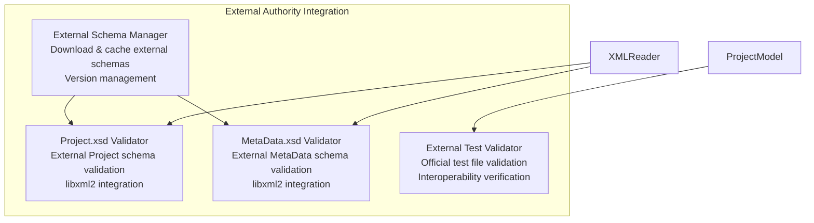
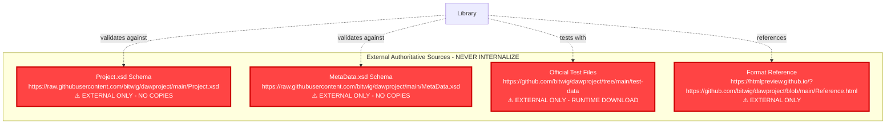
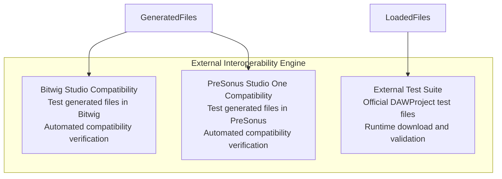

# Architecture Compliance Audit - External Authority Requirements

**Document**: Architecture Gap Analysis  
**Phase**: 03-Architecture  
**Date**: October 10, 2025  
**Status**: Critical Compliance Issues Identified  
**Authority**: External DAWProject Specification

---

## 🚨 Critical Findings - Architecture Non-Compliance with External Authority

### ❌ Major Gap 1: No External Schema Integration

**Issue**: Architecture references generic "XSD validation" but **NEVER** specifies external authoritative schemas

**Current Architecture Problems**:
- `SchemaValidator[Schema Validator<br/>XSD compliance<br/>Structure validation]` - NO external schema reference
- ADR-002 mentions "DAW Project Schema: https://github.com/bitwig/dawproject" but doesn't specify **Project.xsd** and **MetaData.xsd**  
- Validation strategy implements "custom validation" instead of external schema validation
- **NO** integration with authoritative external schemas

**Required Fix**:
```
❌ Current: Generic "XSD validation" 
✅ Required: External schema validation against:
   - https://raw.githubusercontent.com/bitwig/dawproject/main/Project.xsd
   - https://raw.githubusercontent.com/bitwig/dawproject/main/MetaData.xsd
```

### ❌ Major Gap 2: Manual Validation Instead of External Schema Authority

**Issue**: ADR-002 explicitly chooses manual validation over external schema validation

**Problematic Architecture Decision**:
```cpp
// ADR-002 implements CUSTOM validation instead of external authority
class DAWProjectValidator {
    bool validateStructure(const pugi::xml_document& doc) {
        // Custom validation logic - NOT external schema validation
    }
};
```

**Required Architecture Change**:
- Architecture MUST integrate external XSD validation
- Remove custom validation in favor of external schema authority
- pugixml limitation requires libxml2 integration for XSD validation

### ❌ Major Gap 3: No External Interoperability Requirements

**Issue**: Architecture lacks external DAW interoperability validation

**Missing Architecture Components**:
- No validation against Bitwig Studio compatibility
- No validation against PreSonus Studio One compatibility  
- No external test data integration from official repository
- No external format compliance verification

**Required Architecture Addition**:
```
ExternalInteroperabilityValidator[
  External DAW Compatibility<br/>
  Bitwig Studio validation<br/>
  PreSonus Studio One validation<br/>
  Official test file validation
]
```

### ❌ Major Gap 4: Internal Schema References Instead of External Authority

**Issue**: Architecture assumes internal schema knowledge

**Current Problems**:
- References "DAW Project specific business rules" (internal)
- No external schema download/caching strategy
- No external schema version management
- No external authority update mechanism

## 🔧 Required Architecture Updates

### 1. External Schema Integration Architecture

**Add to Validation Engine**:



### 2. External Authority Reference Architecture

**Required External Dependencies**:



### 3. Modified ADR-002: XML Parser Selection

**Critical Update Required**:

**Current ADR-002 Decision**: ❌ pugixml with custom validation  
**Updated ADR-002 Decision**: ✅ pugixml + libxml2 for external XSD validation

**New Architecture Decision**:
- **Primary Parser**: pugixml for performance and integration
- **Schema Validation**: libxml2 integration for external XSD validation
- **External Authority**: Mandatory validation against external Project.xsd and MetaData.xsd
- **No Custom Validation**: Remove all custom validation logic in favor of external authority

### 4. External Interoperability Architecture Component

**Add New Architectural Component**:



## 📋 Architecture Compliance Checklist

### External Authority Integration

- [ ] **External Schema Manager**: Download and cache external XSD schemas at runtime
- [ ] **libxml2 Integration**: Add libxml2 dependency for XSD validation 
- [ ] **Project.xsd Validation**: Mandatory validation against external Project schema
- [ ] **MetaData.xsd Validation**: Mandatory validation against external MetaData schema
- [ ] **External Test Integration**: Download and use official test files for validation
- [ ] **No Schema Copies**: Ensure NO internal copies of external schemas
- [ ] **Version Management**: Handle external schema version changes gracefully

### Interoperability Architecture

- [ ] **Bitwig Studio Validation**: Architecture component for Bitwig compatibility testing
- [ ] **PreSonus Studio One Validation**: Architecture component for PreSonus compatibility testing  
- [ ] **External DAW Testing**: Integration points for testing with external DAWs
- [ ] **Format Compliance**: Strict adherence to external format specification

### Architecture Document Updates Required

- [ ] **Update architecture-specification.md**: Add external authority components
- [ ] **Update ADR-002**: Modify XML parser decision to include libxml2 for XSD validation
- [ ] **Create ADR-009**: External schema validation strategy
- [ ] **Create ADR-010**: External interoperability strategy
- [ ] **Update validation diagrams**: Show external authority integration
- [ ] **Update component diagrams**: Add external schema manager and interop validators

## 🎯 Priority Actions

### Immediate (P0) - Architecture Violations
1. **Update ADR-002**: Change decision to include libxml2 for external XSD validation
2. **Remove Custom Validation**: Eliminate custom validation in favor of external schema authority
3. **Add External Schema Manager**: Architecture component for external schema handling

### High Priority (P1) - External Authority Integration  
1. **Add External Schema Integration**: Architecture components for Project.xsd/MetaData.xsd validation
2. **Add Interoperability Components**: Architecture for external DAW compatibility testing
3. **Update Architecture Diagrams**: Show external authority relationships

### Medium Priority (P2) - Documentation Updates
1. **Update Architecture Specification**: Add external authority sections
2. **Create New ADRs**: Document external schema and interoperability decisions
3. **Update Validation Strategy**: Replace custom validation with external authority approach

---

## ⚠️ Critical Architecture Principle Violations

**VIOLATION 1**: Architecture implements custom validation instead of external schema authority  
**VIOLATION 2**: No external schema integration in validation architecture  
**VIOLATION 3**: Missing external interoperability validation components  
**VIOLATION 4**: No external authority reference management  

**RESOLUTION**: Architecture must be updated to integrate external authoritative sources as primary validation mechanism, not secondary reference.