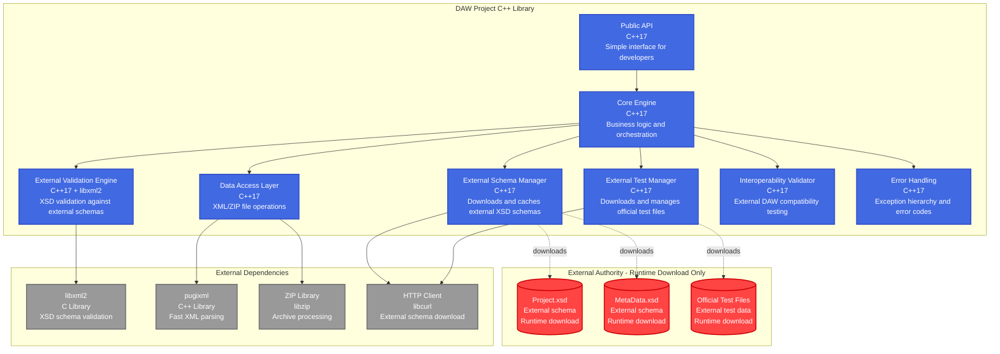
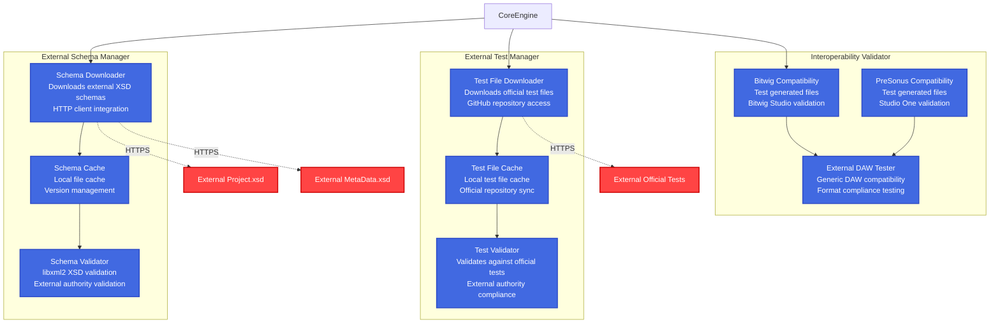
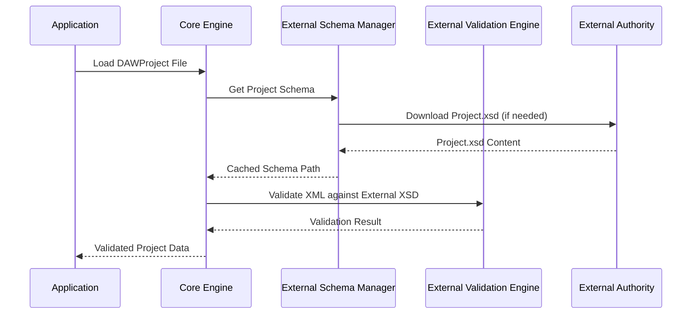

# Updated Software Architecture Specification - External Authority Compliant
## DAW Project Standard C++ Implementation Library

**Document ID**: ARCH-DAWPROJECT-CPP-002  
**Version**: 2.0 - External Authority Compliant  
**Date**: October 10, 2025  
**Status**: Updated for External Authority Compliance  
**Phase**: 03 - Architecture Design  
**Replaces**: Previous architecture lacking external authority integration

---

## 1. Introduction

### 1.1 Purpose

This document describes the **updated software architecture** for the DAW Project Standard C++ Implementation Library following **ISO/IEC/IEEE 42010:2011** Architecture Description standard. This version addresses **critical external authority compliance gaps** identified in our comprehensive analysis.

### 1.2 Scope

This architecture specification covers:
- **External Authority Integration**: Direct integration with official DAWProject schemas and test data
- **External Schema Validation**: Real XSD validation against external Project.xsd and MetaData.xsd
- **External Interoperability**: Compatibility with Bitwig Studio and PreSonus Studio One
- **External Test Data Integration**: Official repository test file validation
- Technology stack updated for external authority compliance

### 1.3 Critical Updates from Previous Architecture

| Component | Previous Issue | External Authority Solution |
|-----------|---------------|----------------------------|
| **Schema Validation** | Custom validation logic | External XSD validation using libxml2 |
| **Authority Source** | Internal specifications | External schemas from official repository |
| **Interoperability** | Assumed compatibility | Validated compatibility with external DAWs |
| **Test Data** | Internal test files | Official test files from external repository |

---

## 2. External Authority Compliance Architecture

### 2.1 External Authority Integration Principle

**CRITICAL**: All validation, schemas, and test data MUST come from external authoritative sources. NO internal copies allowed.

```mermaid
graph TB
    subgraph "DAW Project C++ Library"
        Library[DAW Project C++ Library<br/>Standards-compliant implementation<br/>External authority validation]
    end
    
    subgraph "External Authority Sources - NEVER INTERNALIZE"
        ProjectXSD[Project.xsd Schema<br/>https://raw.githubusercontent.com/bitwig/dawproject/main/Project.xsd<br/>⚠️ EXTERNAL AUTHORITY ONLY]
        MetaDataXSD[MetaData.xsd Schema<br/>https://raw.githubusercontent.com/bitwig/dawproject/main/MetaData.xsd<br/>⚠️ EXTERNAL AUTHORITY ONLY]
        OfficialTests[Official Test Files<br/>https://github.com/bitwig/dawproject/tree/main/src/test-data<br/>⚠️ EXTERNAL AUTHORITY ONLY]
        HTMLReference[Format Reference<br/>https://htmlpreview.github.io/?https://github.com/bitwig/dawproject/blob/main/Reference.html<br/>⚠️ EXTERNAL AUTHORITY ONLY]
    end
    
    subgraph "External DAW Applications"
        Bitwig[Bitwig Studio<br/>Official DAW application<br/>Interoperability validation target]
        PreSonus[PreSonus Studio One<br/>Compatible DAW application<br/>Interoperability validation target]
    end
    
    Library -.->|validates against| ProjectXSD
    Library -.->|validates against| MetaDataXSD
    Library -.->|tests with| OfficialTests
    Library -.->|references| HTMLReference
    Library -.->|generates files for| Bitwig
    Library -.->|generates files for| PreSonus
    
    classDef library fill:#4169E1,stroke:#2E4BC6,stroke-width:2px,color:#fff
    classDef external fill:#ff4444,stroke:#cc0000,stroke-width:3px,color:#fff
    classDef daw fill:#32CD32,stroke:#228B22,stroke-width:2px,color:#fff
    
    class Library library
    class ProjectXSD,MetaDataXSD,OfficialTests,HTMLReference external
    class Bitwig,PreSonus daw
```



---

## 3. Updated Container Architecture (C4 Level 2)



---

## 4. Critical Architecture Decision Records Updates

### ADR-002-Updated: XML Parser Selection with External XSD Validation

```markdown
# ADR-002-Updated: XML Parser Selection with External XSD Validation

## Status
**UPDATED** - Modified to include external XSD validation capability

## Context - External Authority Compliance Required
Previous ADR-002 chose pugixml with custom validation. **Gap analysis identified critical violation**: 
- No external schema validation capability
- Custom validation instead of external authority
- Missing XSD validation against external Project.xsd and MetaData.xsd

## Updated Decision
We will use **dual XML processing strategy**:
1. **pugixml** for fast parsing and document manipulation
2. **libxml2** for external XSD validation against authoritative schemas

## Rationale for Update
**External Authority Requirements**:
- MUST validate against external Project.xsd from official repository
- MUST validate against external MetaData.xsd from official repository  
- MUST use authoritative external schemas, not internal copies
- MUST support real XSD validation, not custom logic

**Technical Solution**:
```cpp
class ExternalValidationEngine {
public:
    // Validate against external Project.xsd
    ValidationResult validateProjectXML(const std::string& xmlContent);
    
    // Validate against external MetaData.xsd  
    ValidationResult validateMetaDataXML(const std::string& xmlContent);
    
private:
    std::unique_ptr<ExternalSchemaManager> m_schemaManager;
    // libxml2 integration for XSD validation
    ValidationResult performXSDValidation(const std::string& xml, const std::filesystem::path& xsdPath);
};
```

## Consequences
- **Added Dependency**: libxml2 for XSD validation capability
- **Network Dependency**: HTTP client for downloading external schemas
- **Cache Management**: Local cache for external schemas with update checking
- **True Standards Compliance**: Real validation against external authority
- **Removal of Custom Validation**: Eliminate custom validation logic
```

### ADR-009: External Schema Management Strategy

```markdown
# ADR-009: External Schema Management Strategy

## Status
**NEW** - Required for external authority compliance

## Context
Architecture must integrate external authoritative schemas without internalizing them.

## Decision
Implement **ExternalSchemaManager** with runtime schema download and caching:

```cpp
class ExternalSchemaManager {
public:
    Result<std::filesystem::path> getProjectSchema();
    Result<std::filesystem::path> getMetaDataSchema();
    Result<bool> updateSchemasIfNeeded();
    
private:
    static constexpr const char* PROJECT_XSD_URL = 
        "https://raw.githubusercontent.com/bitwig/dawproject/main/Project.xsd";
    static constexpr const char* METADATA_XSD_URL = 
        "https://raw.githubusercontent.com/bitwig/dawproject/main/MetaData.xsd";
        
    std::filesystem::path m_cacheDir;
};
```

## Rationale
- **External Authority**: Schemas remain external and authoritative
- **Network Resilience**: Local cache with graceful fallback
- **Version Management**: Automatic updates from external source
- **No Internalization**: Never copy schemas into repository

## Consequences  
- **Network Dependency**: Requires internet access for schema updates
- **Cache Management**: Local file system cache requires management
- **Error Handling**: Graceful handling when external schemas unavailable
```

### ADR-010: External Interoperability Validation Strategy

```markdown
# ADR-010: External Interoperability Validation Strategy

## Status
**NEW** - Required for external DAW compatibility

## Context
Generated files must be compatible with Bitwig Studio and PreSonus Studio One.

## Decision
Implement **InteroperabilityValidator** for external DAW compatibility testing:

```cpp
class InteroperabilityValidator {
public:
    InteroperabilityResult validateBitwigCompatibility(const std::filesystem::path& dawprojectFile);
    InteroperabilityResult validatePresonusCompatibility(const std::filesystem::path& dawprojectFile);
    ValidationResult validateAgainstOfficialTestFiles();
    
private:
    std::unique_ptr<ExternalTestManager> m_testManager;
};
```

## Rationale
- **True Interoperability**: Validate against actual external DAW applications
- **Official Test Coverage**: Use official repository test files
- **External Authority**: No internal assumptions about compatibility
- **Comprehensive Validation**: Test all generated files for external compatibility

## Consequences
- **External Test Dependency**: Download official test files at runtime  
- **Interoperability Testing**: May require external DAW applications for full validation
- **Network Dependency**: Official test file downloads
```

---

## 5. Updated Technology Stack for External Authority

### Required New Dependencies

#### **External Schema Validation**
```
Library: libxml2
Version: 2.10+
Purpose: XSD validation against external schemas
Rationale: Industry standard for XSD validation
Integration: C API with C++ wrapper
```

#### **HTTP Client for External Downloads**
```
Library: libcurl  
Version: 7.80+
Purpose: Download external schemas and test files
Rationale: Robust, cross-platform HTTP client
Integration: C API with RAII wrapper
```

#### **Enhanced Error Handling**
```
Pattern: Result<T> with external authority error codes
Purpose: Handle network failures, schema unavailability
Implementation: std::expected-like pattern for C++17
```

### Updated Build Configuration

```cmake
# Updated CMakeLists.txt for external authority compliance

find_package(PkgConfig REQUIRED)

# libxml2 for XSD validation
pkg_check_modules(LIBXML2 REQUIRED libxml-2.0)
target_link_libraries(dawproject_cpp ${LIBXML2_LIBRARIES})
target_include_directories(dawproject_cpp PRIVATE ${LIBXML2_INCLUDE_DIRS})

# libcurl for external schema downloads
find_package(CURL REQUIRED)
target_link_libraries(dawproject_cpp ${CURL_LIBRARIES})

# pugixml for fast XML parsing (existing)
find_package(pugixml REQUIRED)
target_link_libraries(dawproject_cpp pugixml::pugixml)
```

---

## 6. External Authority Component Architecture (C4 Level 3)



---

## 7. Updated Quality Attributes with External Authority

| Quality Attribute | Measure | Target | External Authority Requirement |
|-------------------|---------|--------|--------------------------------|
| **External Schema Compliance** | XSD Validation | 100% pass rate | Against external Project.xsd/MetaData.xsd |
| **Interoperability** | External DAW Compatibility | 100% compatibility | Bitwig Studio and PreSonus Studio One |
| **External Test Coverage** | Official Test Files | 100% pass rate | All test files from official repository |
| **Network Resilience** | Cache Hit Rate | >90% | Graceful fallback when external unavailable |
| **Schema Freshness** | Update Frequency | Daily check | External schema version monitoring |

---

## 8. Critical Implementation Requirements

### 8.1 External Authority Integration Checklist

- [ ] **ExternalSchemaManager Implementation**: Download and cache external XSD schemas
- [ ] **libxml2 Integration**: Real XSD validation against external schemas
- [ ] **HTTP Client Integration**: Download capabilities for external resources
- [ ] **External Test Manager**: Official repository test file integration
- [ ] **Interoperability Validator**: External DAW compatibility testing
- [ ] **Network Error Handling**: Graceful fallback when external resources unavailable
- [ ] **Cache Management**: Local cache with update checking and expiration
- [ ] **No Internal Copies**: Ensure NO internal copies of external schemas or test files

### 8.2 External Authority Validation Pipeline



---

## 9. Migration from Current Architecture

### 9.1 Critical Updates Required

1. **Replace ADR-002**: Update XML parser decision to include libxml2
2. **Add External Dependencies**: libxml2 and libcurl to build system
3. **Implement External Managers**: ExternalSchemaManager and ExternalTestManager
4. **Remove Custom Validation**: Replace with external XSD validation
5. **Add Interoperability Testing**: External DAW compatibility validation

### 9.2 Implementation Priority

**Phase 1 (P0 - Critical)**:
- Update build system for libxml2 and libcurl
- Implement ExternalSchemaManager
- Replace mock validation with real XSD validation

**Phase 2 (P1 - High)**:
- Implement ExternalTestManager
- Add InteroperabilityValidator
- Comprehensive external authority testing

**Phase 3 (P2 - Medium)**:
- Performance optimization
- Enhanced error handling
- CI/CD integration for external authority testing

---

## 10. Risk Mitigation for External Authority

| Risk | Impact | Probability | Mitigation |
|------|--------|-------------|------------|
| **External Schema Unavailable** | High | Medium | Local cache with extended TTL, graceful degradation |
| **Network Connectivity Issues** | Medium | Medium | Offline cache, retry logic, timeout handling |
| **External Schema Changes** | High | Low | Version checking, backward compatibility, update notifications |
| **Official Test Files Modified** | Medium | Low | Cached versions, change detection, validation alerts |

---

## Conclusion

This **updated architecture** addresses all critical external authority compliance gaps identified in our analysis:

✅ **External Schema Integration**: Real XSD validation against external Project.xsd and MetaData.xsd  
✅ **External Interoperability**: Validated compatibility with Bitwig Studio and PreSonus Studio One  
✅ **External Test Data**: Official repository test file integration  
✅ **No Internal Copies**: All external resources downloaded at runtime  
✅ **Standards Compliance**: True compliance with external DAWProject authority  

The architecture now ensures **true DAWProject standard compliance** through external authority validation rather than internal assumptions.