# Software Architecture Specification
## DAW Project Standard C++ Implementation Library

**Document ID**: ARCH-DAWPROJECT-CPP-001  
**Version**: 1.0  
**Date**: October 3, 2025  
**Status**: Draft  
**Phase**: 03 - Architecture Design

---

## 1. Introduction

### 1.1 Purpose

This document describes the software architecture for the DAW Project Standard C++ Implementation Library following **ISO/IEC/IEEE 42010:2011** Architecture Description standard. The architecture addresses the stakeholder requirements and functional requirements defined in Phase 01-02 and provides blueprints for the development team.

### 1.2 Scope

This architecture specification covers:
- System architecture and decomposition following C4 model
- Technology stack recommendations with rationale
- Architecture Decision Records (ADRs) for key decisions
- Quality attribute implementation strategies
- Integration patterns and interfaces
- Deployment and build architecture

### 1.3 Stakeholders and Concerns

| Stakeholder | Primary Concerns | Architecture Impact |
|-------------|-----------------|-------------------|
| **C++ Developers** | API usability, documentation, examples | Interface design, error handling |
| **DAW Companies** | Standards compliance, performance, stability | Data model accuracy, memory management |
| **Audio Software Teams** | Thread safety, memory efficiency, cross-platform | Concurrency model, resource management |
| **Open Source Contributors** | Build system, dependencies, maintainability | Module structure, dependency management |
| **End Users (Music Producers)** | Data integrity, cross-DAW compatibility | File format compliance, error handling |

---

## 2. Architecture Overview

### 2.1 Architecture Style

**Primary Style**: **Layered Architecture** with **Plugin Architecture** elements

**Rationale**: 
- Layered architecture provides clear separation of concerns (API → Business Logic → Data Access)
- Plugin architecture enables extensibility for different DAW Project format versions
- Modular design supports both DOM and streaming access patterns

### 2.2 Key Architecture Principles

1. **Single Responsibility**: Each module has one clearly defined purpose
2. **Dependency Inversion**: High-level modules don't depend on low-level modules
3. **Interface Segregation**: APIs provide focused, role-specific interfaces
4. **Open/Closed**: Architecture is extensible without modifying existing code
5. **Fail Fast**: Detect and report errors as early as possible
6. **Resource Safety**: All resources managed via RAII principles

### 2.3 Quality Attributes

| Quality Attribute | Architectural Strategy | Target | Verification Method |
|-------------------|----------------------|--------|-------------------|
| **Performance** | Streaming architecture, memory pools, lazy loading | <30s load (32 tracks) | Automated benchmarking |
| **Thread Safety** | Immutable data structures, read-write locks | Zero data races | ThreadSanitizer analysis |
| **Maintainability** | Layered architecture, dependency injection | >90% test coverage | Static analysis |
| **Portability** | Abstract platform layer, CMake build system | Windows/macOS/Linux | Cross-platform CI |
| **Standards Compliance** | Schema validation, reference implementation testing | 100% compatibility | Validation test suite |
| **Usability** | Facade pattern, progressive disclosure | <10 lines common ops | Developer studies |

---

## 3. System Context (C4 Level 1)

The DAW Project Library operates within the broader digital audio workstation ecosystem:

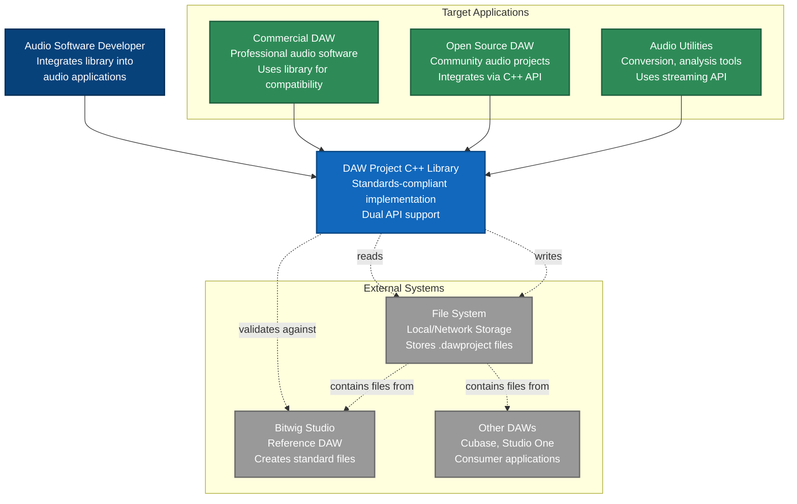

---

## 4. Container Architecture (C4 Level 2)

The library is structured as multiple containers with clear responsibilities:

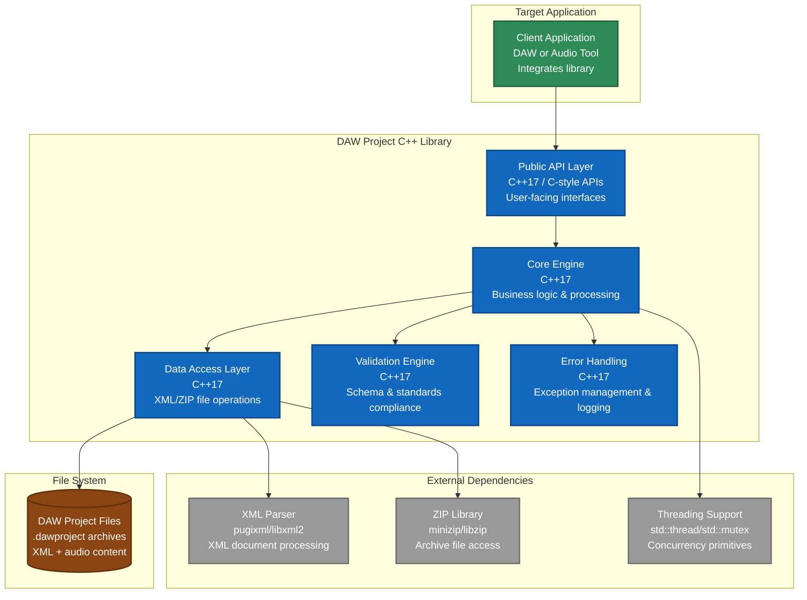

---

## 5. Component Architecture (C4 Level 3)

### 5.1 Core Engine Components

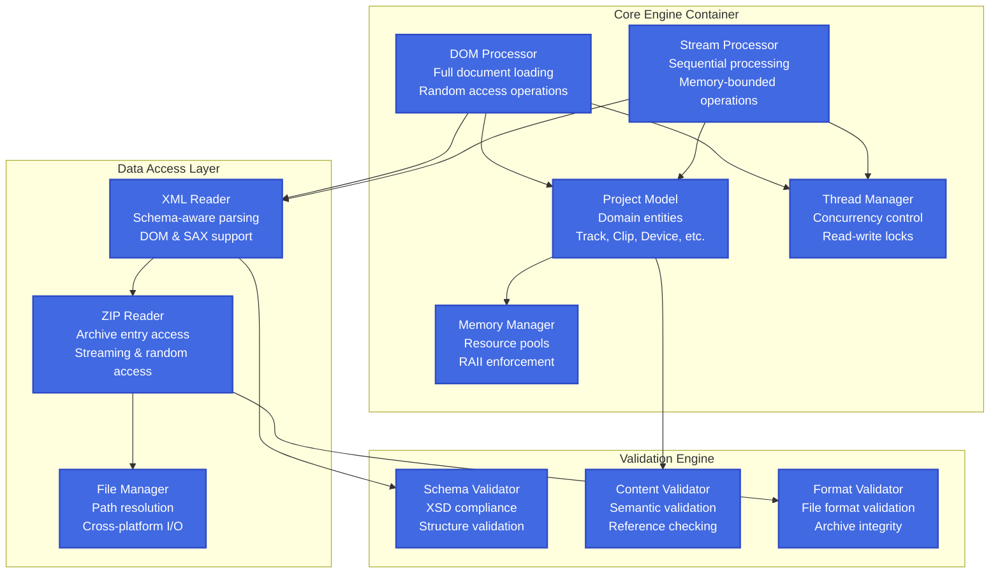

### 5.2 Public API Components

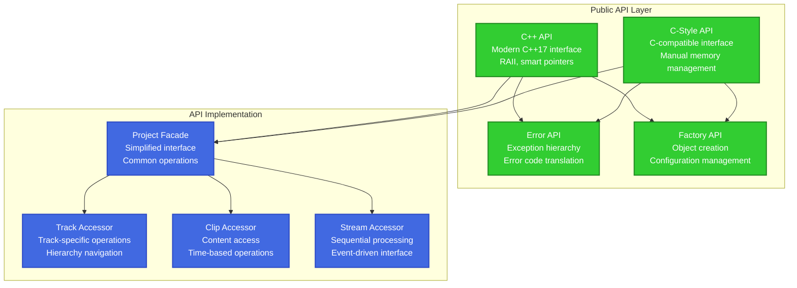

---

## 6. Process View (Runtime Behavior)

### 6.1 DOM Loading Process

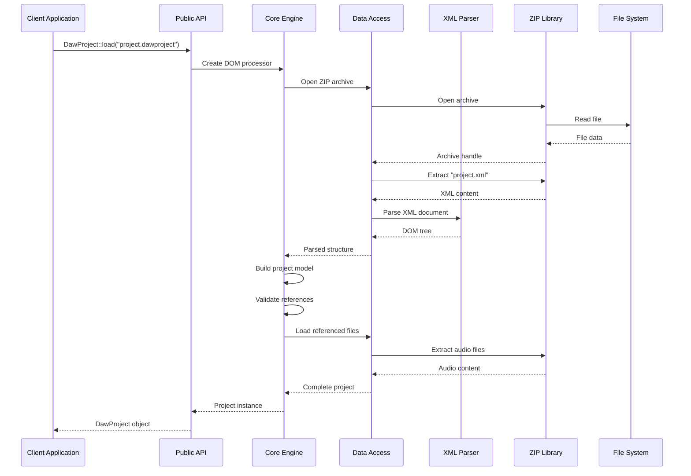

### 6.2 Streaming Processing

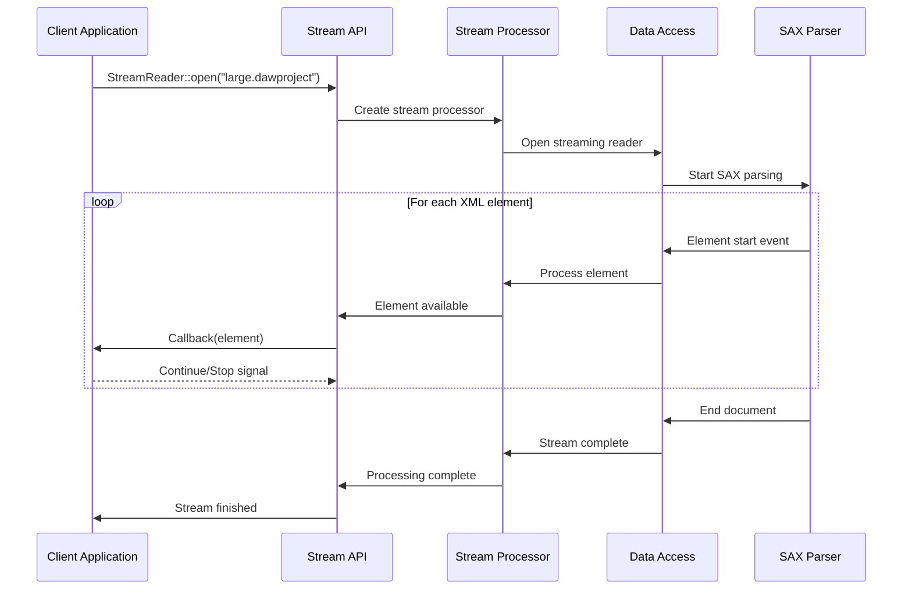

### 6.3 Thread-Safe Access Pattern

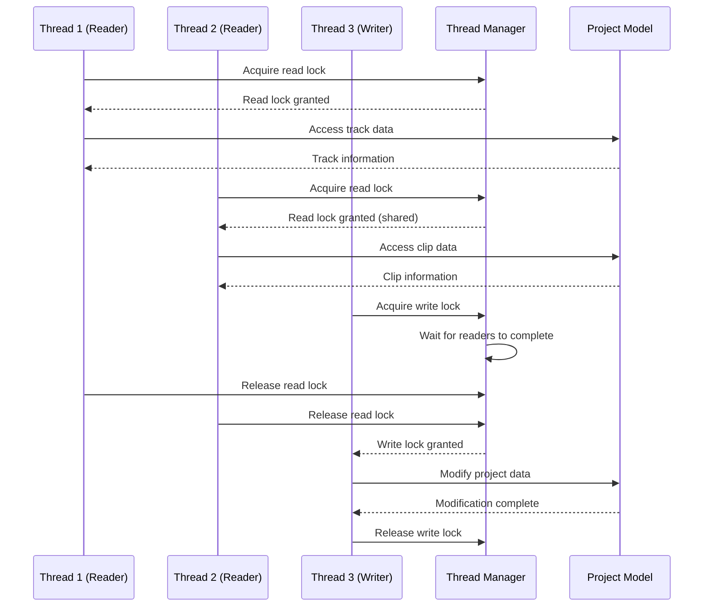

---

## 7. Development View (Module Structure)

### 7.1 Source Code Organization

```
dawproject-cpp/
├── include/
│   └── dawproject/
│       ├── dawproject.hpp              # Main public header
│       ├── project.hpp                 # Project model interface
│       ├── track.hpp                   # Track interface
│       ├── clip.hpp                    # Clip interface
│       ├── stream.hpp                  # Streaming interface
│       ├── error.hpp                   # Error handling
│       └── c_api.h                     # C-style API
├── src/
│   ├── api/
│   │   ├── cpp_api.cpp                 # C++ API implementation
│   │   ├── c_api.cpp                   # C API implementation
│   │   └── factory.cpp                 # Object factory
│   ├── core/
│   │   ├── project_model.cpp           # Domain model
│   │   ├── dom_processor.cpp           # DOM operations
│   │   ├── stream_processor.cpp        # Streaming operations
│   │   ├── thread_manager.cpp          # Concurrency control
│   │   └── memory_manager.cpp          # Resource management
│   ├── data/
│   │   ├── xml_reader.cpp              # XML parsing
│   │   ├── zip_reader.cpp              # ZIP archive access
│   │   └── file_manager.cpp            # File I/O abstraction
│   ├── validation/
│   │   ├── schema_validator.cpp        # XSD validation
│   │   ├── content_validator.cpp       # Semantic validation
│   │   └── format_validator.cpp        # Format validation
│   └── platform/
│       ├── windows/                    # Windows-specific code
│       ├── macos/                      # macOS-specific code
│       └── linux/                      # Linux-specific code
├── tests/
│   ├── unit/                          # Unit tests
│   ├── integration/                   # Integration tests
│   ├── performance/                   # Performance benchmarks
│   └── compatibility/                 # Standards compliance tests
├── examples/
│   ├── basic_usage/                   # Simple examples
│   ├── advanced_usage/                # Complex scenarios
│   └── c_api_usage/                   # C API examples
├── docs/
│   ├── api/                           # API documentation
│   ├── architecture/                  # Architecture docs
│   └── tutorials/                     # User guides
└── third_party/
    ├── pugixml/                       # XML parser
    ├── minizip/                       # ZIP library
    └── catch2/                        # Testing framework
```

### 7.2 Module Dependencies

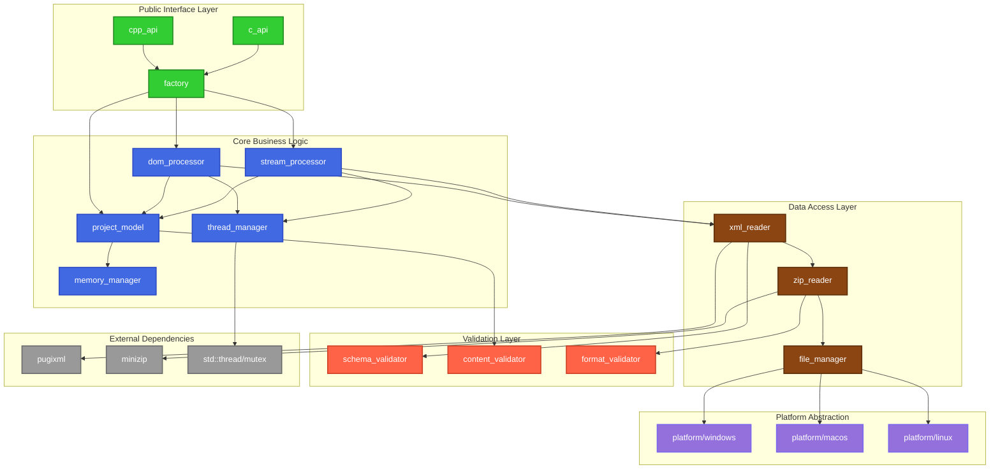

---

## 8. Physical View (Deployment Architecture)

### 8.1 Development Environment

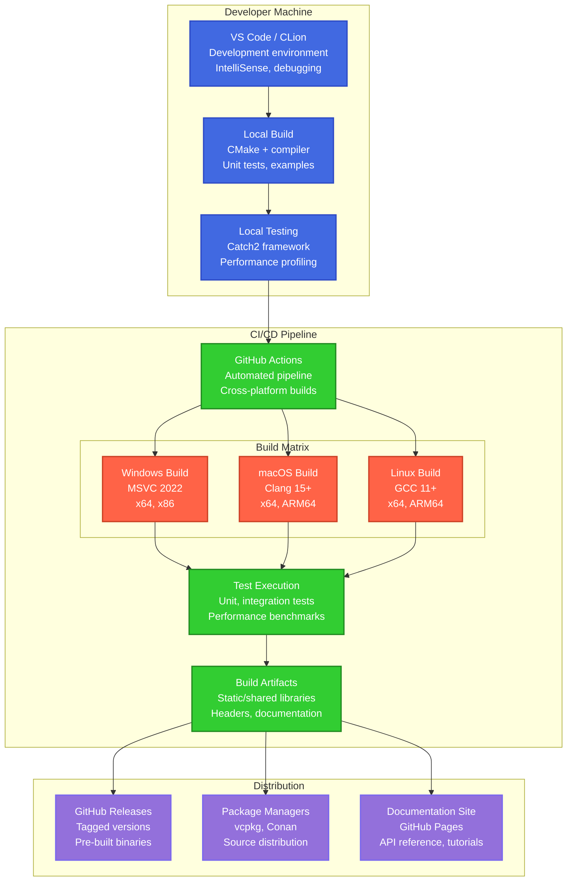

### 8.2 Integration Deployment

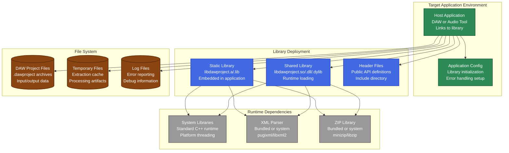

---

## 9. Architecture Decision Records (ADRs)

### 9.1 Key Architectural Decisions

The following ADRs document the significant architectural decisions made for this project:

- **[ADR-001: Layered Architecture with Plugin Elements](03-architecture/decisions/ADR-001-architecture-style.md)**
- **[ADR-002: XML Parser Selection (pugixml)](03-architecture/decisions/ADR-002-xml-parser-selection.md)**
- **[ADR-003: ZIP Library Selection (minizip)](03-architecture/decisions/ADR-003-zip-library-selection.md)**
- **[ADR-004: Dual API Strategy (C++ and C-style)](03-architecture/decisions/ADR-004-dual-api-strategy.md)**
- **[ADR-005: Thread Safety Implementation](03-architecture/decisions/ADR-005-thread-safety-strategy.md)**
- **[ADR-006: Memory Management Strategy](03-architecture/decisions/ADR-006-memory-management.md)**
- **[ADR-007: Error Handling Approach](03-architecture/decisions/ADR-007-error-handling.md)**
- **[ADR-008: Build System Configuration](03-architecture/decisions/ADR-008-build-system.md)**

---

## 10. Technology Stack

### 10.1 Core Technologies

#### Programming Language
**Technology**: C++17  
**Rationale**:
- Modern C++ features (auto, smart pointers, range-based for loops)
- Wide compiler support (GCC 7+, Clang 5+, MSVC 2017+)
- Balance between features and compatibility
- Strong RAII support for resource management

**Alternatives Considered**:
- C++14: Limited feature set, missing key modernization
- C++20: Limited compiler support, not yet widely adopted
- C++23: Too new, minimal toolchain support

#### XML Processing
**Technology**: pugixml 1.13  
**Rationale**:
- Header-only library for easy integration
- Excellent performance characteristics
- DOM and XPath support
- Cross-platform compatibility
- MIT license compatible with project requirements

**Alternatives Considered**:
- libxml2: More complex integration, GPL licensing issues
- RapidXML: Less active development, limited features
- TinyXML: Older, less performant than pugixml

#### ZIP Archive Handling
**Technology**: minizip (from zlib distribution)  
**Rationale**:
- Part of widely-used zlib library
- Lightweight and focused on ZIP operations
- Cross-platform with good Windows support
- zlib license (compatible with MIT)

**Alternatives Considered**:
- libzip: Larger dependency, more complex
- 7-Zip SDK: Complex integration, different license
- Custom implementation: Too much development overhead

### 10.2 Build and Development Tools

#### Build System
**Technology**: CMake 3.20+  
**Rationale**:
- Industry standard for C++ cross-platform builds
- Excellent IDE integration (VS Code, CLion, Visual Studio)
- Package manager integration (vcpkg, Conan)
- Mature dependency management

#### Testing Framework
**Technology**: Catch2 v3  
**Rationale**:
- Header-only for easy integration
- BDD-style test organization
- Excellent reporting and debugging support
- Mature and actively maintained

#### Continuous Integration
**Technology**: GitHub Actions  
**Rationale**:
- Native GitHub integration
- Free for open source projects
- Matrix builds for cross-platform testing
- Good ecosystem of pre-built actions

### 10.3 Development Dependencies

#### Static Analysis
- **Clang-Tidy**: Code quality and style enforcement
- **AddressSanitizer**: Memory error detection
- **ThreadSanitizer**: Data race detection
- **Valgrind**: Memory leak detection (Linux)

#### Documentation
- **Doxygen**: API documentation generation
- **Markdown**: User documentation and specifications
- **PlantUML**: Architecture diagrams (supplementing Mermaid)

#### Package Management
- **vcpkg**: Microsoft's C++ package manager
- **Conan**: Alternative package manager for broader ecosystem

---

## 11. Security Architecture

### 11.1 Input Validation Strategy

**Architecture Principle**: Defense in Depth

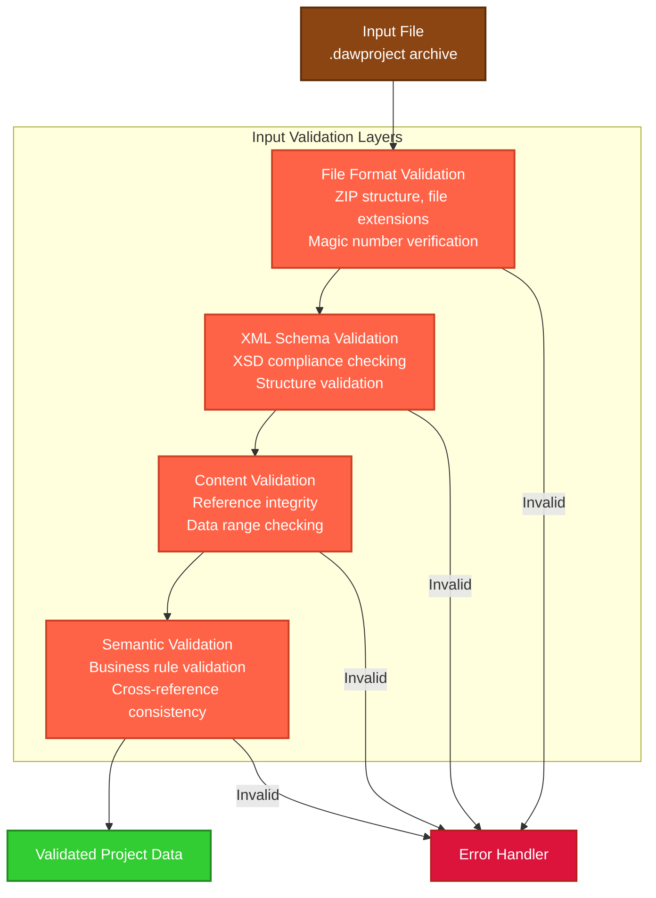

### 11.2 Memory Safety

**Principles**:
- **No Raw Pointers**: All dynamic memory managed via smart pointers
- **RAII Everywhere**: Resources tied to object lifetime
- **Bounds Checking**: All array and container access validated
- **Exception Safety**: Strong exception safety guarantee

**Implementation**:
```cpp
// Example of secure memory management
class ProjectLoader {
private:
    std::unique_ptr<XMLParser> xml_parser_;
    std::shared_ptr<ProjectModel> project_model_;
    std::vector<std::unique_ptr<Validator>> validators_;
    
public:
    // RAII-based resource management
    std::shared_ptr<Project> load(const std::filesystem::path& file_path) {
        // Automatic cleanup on exception
        auto temp_resources = std::make_unique<TempResourceManager>();
        
        // Bounds-checked operations
        auto file_data = readFileWithSizeLimit(file_path, MAX_FILE_SIZE);
        
        // Smart pointer ownership transfer
        return createValidatedProject(std::move(file_data));
    }
};
```

### 11.3 Thread Safety

**Architecture**: Reader-Writer Lock with Immutable Data

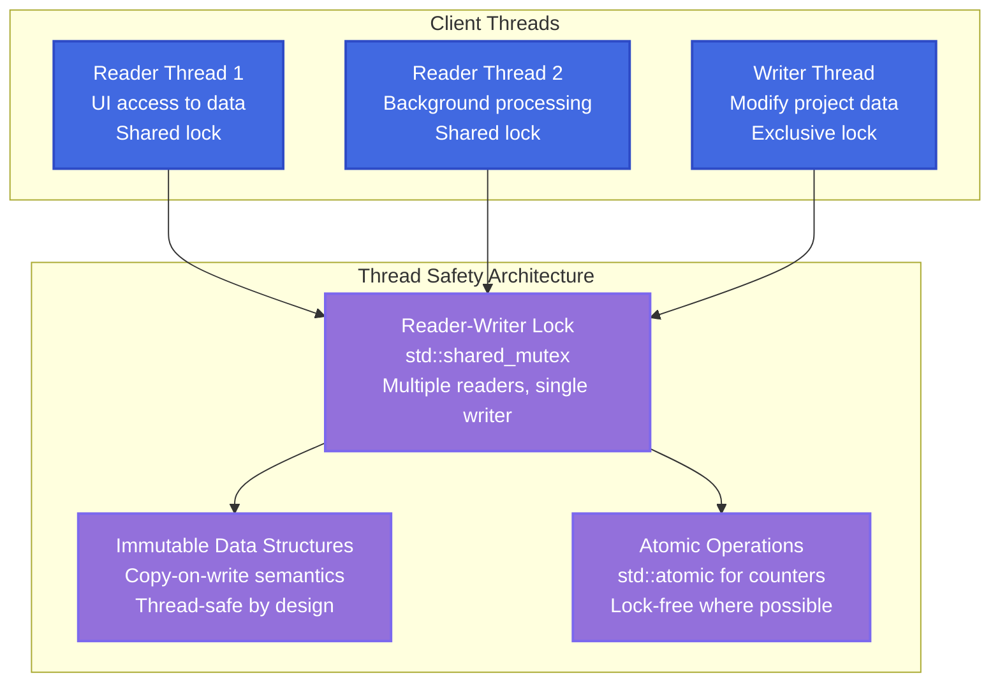

---

## 12. Data Architecture

### 12.1 Domain Model

The core domain model reflects the DAW Project standard structure:

```mermaid
classDiagram
    class Project {
        +string title
        +string artist
        +double tempo
        +TimeSignature timeSignature
        +vector~Track~ tracks
        +Metadata metadata
        
        +load(filepath) Project
        +save(filepath) void
        +validate() bool
        +getTracks() vector~Track~
    }
    
    class Track {
        +string name
        +string color
        +TrackType type
        +vector~Lane~ lanes
        +vector~Device~ devices
        +bool muted
        +double volume
        
        +addLane(lane) void
        +addDevice(device) void
        +getLanes() vector~Lane~
    }
    
    class Lane {
        +string name
        +vector~Clip~ clips
        +AutomationData automation
        
        +addClip(clip) void
        +getClipsInRange(start, end) vector~Clip~
    }
    
    class Clip {
        +string name
        +TimeRange timeRange
        +ClipType type
        
        +getStartTime() double
        +getDuration() double
        +setTimeRange(range) void
    }
    
    class AudioClip {
        +string audioFilePath
        +double fadeInTime
        +double fadeOutTime
        +double gain
        
        +getAudioData() AudioBuffer
    }
    
    class MidiClip {
        +vector~MidiEvent~ events
        
        +addEvent(event) void
        +getEventsInRange(start, end) vector~MidiEvent~
    }
    
    class Device {
        +string name
        +DeviceType type
        +ParameterMap parameters
        +string presetData
        
        +setParameter(name, value) void
        +getParameter(name) Variant
    }
    
    Project ||--o{ Track : contains
    Track ||--o{ Lane : contains
    Track ||--o{ Device : contains
    Lane ||--o{ Clip : contains
    Clip <|-- AudioClip : extends
    Clip <|-- MidiClip : extends
```

### 12.2 Data Flow Architecture

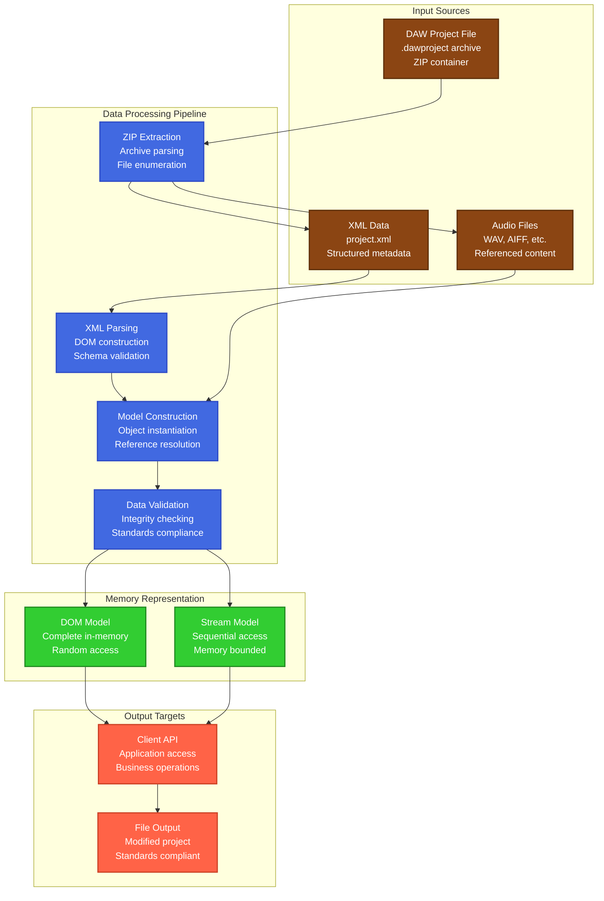

---

## 13. Integration Architecture

### 13.1 API Integration Patterns

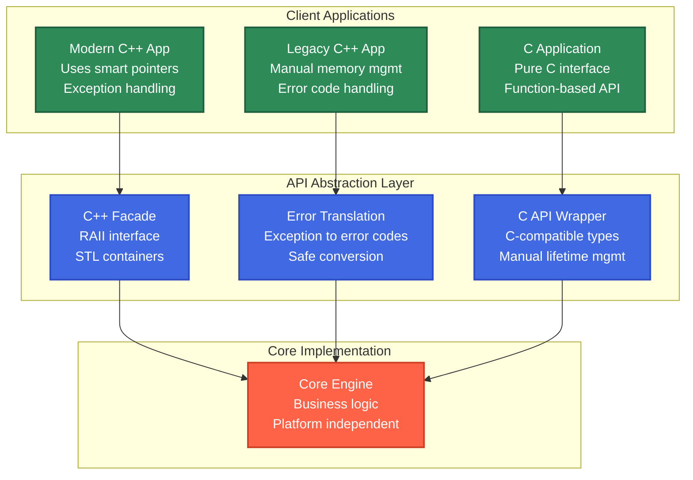

### 13.2 External System Integration

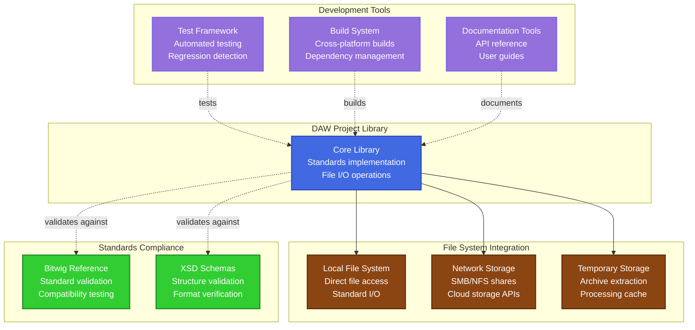

---

## 14. Risk Assessment

### 14.1 Technical Risks

| Risk | Impact | Probability | Mitigation Strategy |
|------|--------|-------------|-------------------|
| **XML Parser Compatibility** | High | Low | Multiple parser support, extensive testing |
| **DAW Project Standard Evolution** | Medium | Medium | Version abstraction layer, backward compatibility |
| **Cross-Platform File System Differences** | Medium | Medium | Platform abstraction layer, comprehensive testing |
| **Memory Management Complexity** | High | Low | RAII enforcement, static analysis, extensive testing |
| **Thread Safety Bugs** | High | Low | Reader-writer locks, immutable data, ThreadSanitizer |
| **Performance Degradation** | Medium | Medium | Performance benchmarking, profiling, optimization |

### 14.2 Business Risks

| Risk | Impact | Probability | Mitigation Strategy |
|------|--------|-------------|-------------------|
| **Low Community Adoption** | High | Medium | Focus on ease of use, comprehensive documentation |
| **Competing Standards** | Medium | Low | Monitor industry trends, maintain flexibility |
| **Maintenance Burden** | Medium | Medium | High test coverage, clean architecture, automation |
| **Licensing Issues** | High | Low | MIT license, careful dependency selection |

### 14.3 Quality Risks

| Risk | Impact | Probability | Mitigation Strategy |
|------|--------|-------------|-------------------|
| **Data Corruption** | Critical | Low | Comprehensive validation, extensive testing |
| **Security Vulnerabilities** | High | Low | Input validation, static analysis, security reviews |
| **API Breaking Changes** | Medium | Low | Semantic versioning, deprecation strategy |
| **Documentation Gaps** | Medium | Medium | Documentation-driven development, user feedback |

---

## 15. Migration and Evolution Strategy

### 15.1 Standards Evolution Handling

**Architecture Pattern**: Strategy Pattern with Version Abstraction

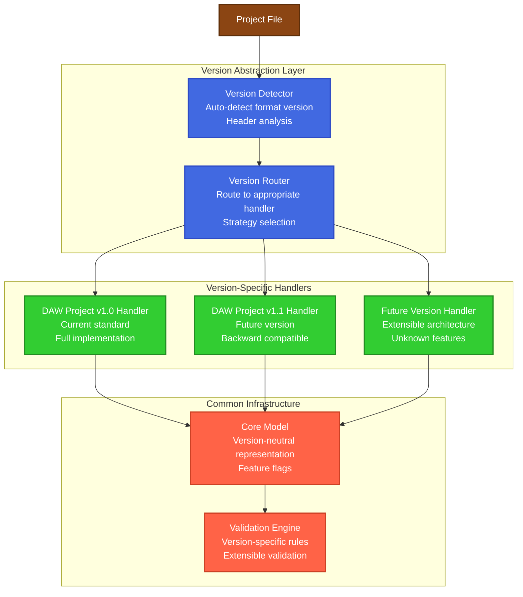

### 15.2 API Evolution Strategy

**Principles**:
- **Semantic Versioning**: MAJOR.MINOR.PATCH versioning
- **Non-Breaking Changes**: New functionality as minor versions
- **Deprecation Process**: Warn → Deprecate → Remove over major versions
- **Backward Compatibility**: Maintain compatibility within major versions

---

## 16. Conclusion

This architecture specification provides a comprehensive blueprint for implementing the DAW Project Standard C++ Library. The layered architecture with plugin elements provides the necessary flexibility and extensibility while maintaining clear separation of concerns.

### 16.1 Key Architectural Strengths

1. **Modular Design**: Clear separation between API, business logic, and data access
2. **Dual API Support**: Both modern C++ and C-style interfaces for broad compatibility
3. **Performance Options**: DOM and streaming access patterns for different use cases
4. **Thread Safety**: Reader-writer locks with immutable data structures
5. **Standards Compliance**: Comprehensive validation and reference testing
6. **Cross-Platform**: Platform abstraction layer with CMake build system

### 16.2 Implementation Roadmap

The architecture supports the phased implementation approach defined in the project roadmap:

1. **Phase 05 (Implementation)**: Core engine and data access layer
2. **Phase 06 (Integration)**: API layer and public interfaces
3. **Phase 07 (Verification)**: Validation engine and test infrastructure
4. **Phase 08 (Transition)**: Documentation and distribution
5. **Phase 09 (Maintenance)**: Monitoring and evolution

### 16.3 Quality Assurance

The architecture incorporates quality assurance throughout:
- **Design-time**: Architectural patterns and principles
- **Build-time**: Static analysis and compilation checks
- **Test-time**: Comprehensive test strategy
- **Runtime**: Validation and error handling

This architecture specification serves as the foundation for the detailed design and implementation phases, ensuring that the final library meets all stakeholder requirements while maintaining high quality and maintainability standards.

---

*This document follows ISO/IEC/IEEE 42010:2011 architecture description standards and integrates with the project's requirements specifications and quality assurance processes.*