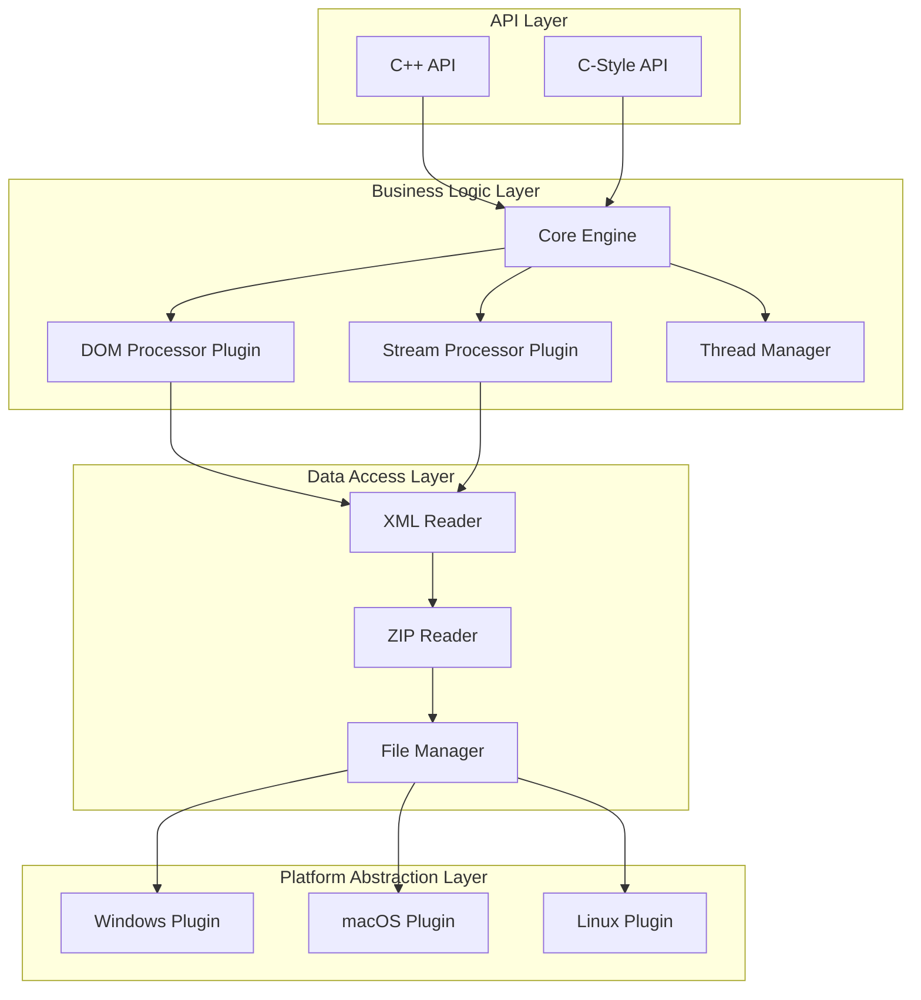

# ADR-001: Layered Architecture with Plugin Elements

## Status
Accepted (Approved by Architecture Team on 2025-10-03)

## Metadata
- Date: 2025-10-03
- Deciders: Architecture Team
- Technical Story: Phase 03 - Architecture Design

## Requirements Addressed
This architectural style directly supports or constrains the following functional and non-functional requirements. Detailed per-requirement design rationales will be elaborated in subsequent detailed design specifications; inclusion here establishes traceability for the high-level architectural decision.

### Functional
- REQ-F-001 – Core read/write project manipulation
- REQ-F-004 – Support for project initialization workflows
- REQ-F-005 – Project metadata extraction
- REQ-F-006 – Track enumeration & basic access
- REQ-F-007 – Clip enumeration & basic access
- REQ-F-008 – Plugin (effect/instrument) listing
- REQ-F-011 – Streaming (bounded memory) read capability
- REQ-F-012 – DOM (full in-memory) read capability
- REQ-F-015 – Dual API exposure (C++ and C-style)
- REQ-F-019 – Cross-platform project loading
- REQ-F-020 – Cross-platform project saving
- REQ-F-021 – Thread-safe concurrent read (multi-reader)
- REQ-F-030 – Version negotiation (future format versions)
- REQ-F-038 – Layered extensibility for new processors
- REQ-F-041 – Pluggable platform abstractions
- REQ-F-042 – Separation of parsing from business logic
- REQ-F-045 – Strategy selection between DOM and streaming

### Non-Functional
- REQ-NF-001 – Maintainable modular structure
- REQ-NF-004 – Performance (project load time targets)
- REQ-NF-005 – Memory efficiency (streaming constraints)
- REQ-NF-008 – Testability (unit isolation per layer)
- REQ-NF-010 – Extensibility (add new format versions)
- REQ-NF-020 – Portability (Windows/macOS/Linux)

---

## Context

We need to select an architectural style for the DAW Project C++ Library that supports:

- **Dual API Support**: Both modern C++ and C-style interfaces
- **Dual Access Patterns**: DOM (full in-memory) and streaming (bounded memory) 
- **Cross-Platform Compatibility**: Windows, macOS, Linux
- **Thread Safety**: Multiple readers, single writer access patterns
- **Standards Compliance**: Bitwig DAW Project v1.0 with future version extensibility
- **Performance Requirements**: <30s load time for 32-track projects, <500MB memory in streaming mode

## Decision

We will implement a **Layered Architecture** with **Plugin Architecture** elements.

### Primary Architecture: Layered Architecture

**4-Layer Structure**:
1. **API Layer**: Public interfaces (C++ and C-style APIs)
2. **Business Logic Layer**: Core engine, processing logic, domain model
3. **Data Access Layer**: XML/ZIP parsing, file I/O operations
4. **Platform Abstraction Layer**: OS-specific implementations

**Layer Dependencies**: Each layer only depends on layers below it (no circular dependencies).

### Plugin Elements: Strategy Pattern for Extensibility

**Plugin Components**:
- **Access Pattern Plugins**: DOM processor, Stream processor
- **Format Version Plugins**: DAW Project v1.0, future versions
- **Platform Plugins**: Windows, macOS, Linux specific implementations

## Rationale

### Why Layered Architecture?

**✅ Advantages**:
- **Clear Separation of Concerns**: Each layer has distinct responsibility
- **Testability**: Each layer can be unit tested independently
- **Maintainability**: Changes in one layer don't ripple through entire system
- **Team Development**: Different teams can work on different layers
- **Cross-Platform Support**: Platform abstraction layer isolates OS differences

**✅ Aligns with Requirements**:
- **Dual APIs**: API layer can provide multiple interfaces to same business logic
- **Performance**: Business logic layer can optimize without affecting APIs
- **Thread Safety**: Can be implemented consistently across all layers
- **Standards Compliance**: Data access layer handles all format-specific logic

### Why Plugin Elements?

**✅ Advantages**:
- **Extensibility**: New DAW Project versions can be added as plugins
- **Performance Options**: DOM vs. streaming as pluggable strategies
- **Platform Support**: Platform-specific code isolated in plugins

**✅ Aligns with Requirements**:
- **Dual Access Patterns**: DOM and streaming processors as strategy plugins
- **Future Standards**: Version-specific processors as plugins
- **Cross-Platform**: Platform abstraction as plugin architecture

### Alternative Architectures Considered

#### ❌ **Microservices Architecture**
**Rejected Reason**: Overkill for a library. Adds network complexity without benefits.
- **Pros**: High scalability, fault isolation
- **Cons**: Network overhead, deployment complexity, unsuitable for library

#### ❌ **Monolithic Architecture**  
**Rejected Reason**: Doesn't support dual access patterns and extensibility requirements.
- **Pros**: Simple deployment, easy debugging
- **Cons**: Poor separation of concerns, difficult to extend, platform coupling

#### ⚠️ **Hexagonal Architecture (Ports & Adapters)**
**Considered but Rejected**: More complex than needed for this domain.
- **Pros**: Excellent testability, dependency inversion
- **Cons**: Over-engineering for file processing library, learning curve

#### ⚠️ **Component-Based Architecture**
**Considered but Rejected**: Similar benefits to chosen approach but more coupling.
- **Pros**: Reusable components, clear interfaces
- **Cons**: More complex inter-component communication, harder to maintain

## Implementation Strategy

### Layer Boundaries



### Plugin Interface Example

```cpp
// Strategy pattern for access methods
class IAccessStrategy {
public:
    virtual ~IAccessStrategy() = default;
    virtual std::shared_ptr<Project> loadProject(const std::filesystem::path& path) = 0;
    virtual void saveProject(const Project& project, const std::filesystem::path& path) = 0;
    virtual bool supportsStreamingAccess() const = 0;
};

class DOMAccessStrategy : public IAccessStrategy {
    // Full document in memory, random access
};

class StreamAccessStrategy : public IAccessStrategy {
    // Sequential processing, bounded memory
};

// Plugin factory
class AccessStrategyFactory {
public:
    static std::unique_ptr<IAccessStrategy> create(AccessMode mode) {
        switch (mode) {
            case AccessMode::DOM: return std::make_unique<DOMAccessStrategy>();
            case AccessMode::Stream: return std::make_unique<StreamAccessStrategy>();
        }
    }
};
```

## Consequences

### Positive Consequences

✅ **Maintainability**: Clear layer boundaries make code easier to understand and modify  
✅ **Testability**: Each layer can be unit tested with mocked dependencies  
✅ **Extensibility**: Plugin architecture allows adding new features without changing core  
✅ **Performance**: Can optimize each layer independently  
✅ **Cross-Platform**: Platform abstraction layer provides clean separation  
✅ **Team Development**: Teams can work on different layers simultaneously  

### Negative Consequences

⚠️ **Performance Overhead**: Layer boundaries add slight function call overhead  
**Mitigation**: Use inlining for performance-critical paths, profile and optimize  

⚠️ **Complexity**: More complex than monolithic approach  
**Mitigation**: Clear documentation, good naming conventions, comprehensive tests  

⚠️ **Plugin Management**: Need to manage plugin lifecycle and discovery  
**Mitigation**: Simple factory pattern, compile-time plugin registration  

### Risk Mitigation

| Risk | Impact | Mitigation |
|------|--------|------------|
| **Layer Violations** | Medium | Enforce with static analysis tools, code reviews |
| **Plugin Interface Changes** | High | Semantic versioning, deprecation process |
| **Performance Regression** | Medium | Continuous benchmarking, performance tests |
| **Complexity Overhead** | Low | Good documentation, developer training |

## Compliance with Requirements

| Requirement | How Architecture Addresses |
|-------------|---------------------------|
| **STR-FUNC-001 (Complete Read-Write Support)** | Data access layer handles all format operations |
| **STR-FUNC-002 (Dual Access Patterns)** | DOM and Stream processors as plugins |
| **STR-FUNC-003 (Thread Safety)** | Thread manager in business logic layer |
| **STR-USER-001 (Intuitive C++ API)** | API layer provides clean interfaces |
| **STR-PERF-001 (Large Project Handling)** | Streaming processor plugin for memory efficiency |
| **NFR-COMPAT-001 (Cross-Platform)** | Platform abstraction layer |

## References

- **ISO/IEC/IEEE 42010:2011**: Architecture description standards
- **"Pattern-Oriented Software Architecture"** by Buschmann et al.
- **"Clean Architecture"** by Robert C. Martin
- **Project Requirements**: [stakeholder-requirements-spec.md](../../01-stakeholder-requirements/stakeholder-requirements-spec.md)

---

*This ADR follows the architecture decision record format and contributes to the overall system architecture documentation.*