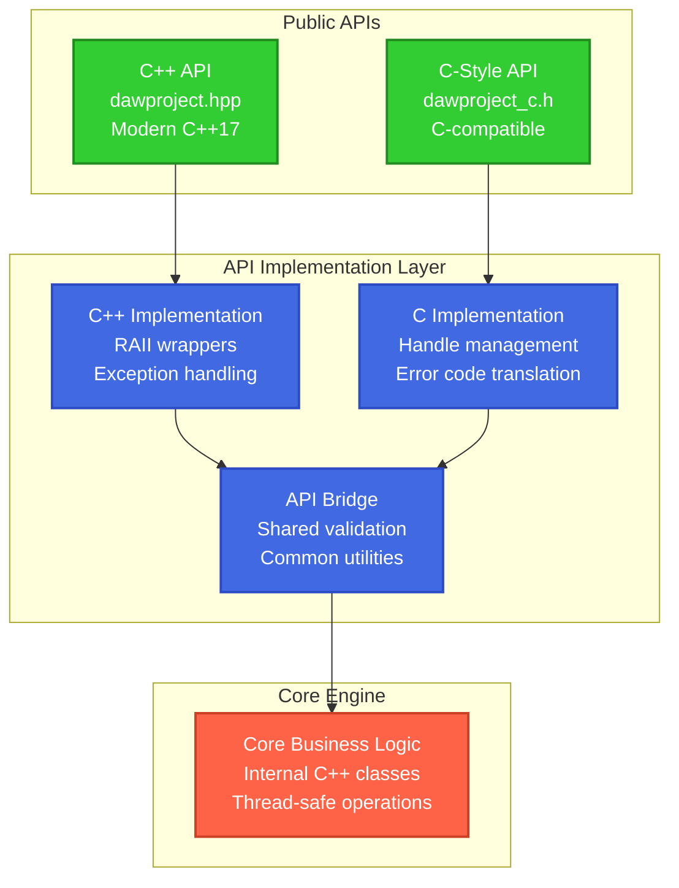

# ADR-004: Dual API Strategy (C++ and C-style)

## Status

Accepted (2025-10-03) – dual API approach approved (modern C++ + C layer).

**Deciders**: Architecture Team  
**Technical Story**: API Design for Maximum Compatibility

---

## Context

We need to design public APIs that serve different types of developers and integration scenarios:

**Target Audiences**:
- **Modern C++ Developers**: Want RAII, smart pointers, STL containers, exceptions
- **Legacy C++ Projects**: Limited C++11/14, manual memory management, error codes
- **C Projects**: Pure C compatibility, function-based APIs, no C++ features
- **Language Bindings**: Python, Rust, Go bindings need C-style interfaces

**Requirements**:
- **STR-USER-001**: Intuitive C++ API design for different experience levels
- **Wide Compatibility**: Support projects with different C++ standards
- **Error Handling**: Both exceptions and error codes
- **Memory Management**: Both automatic (RAII) and manual management
- **Performance**: No overhead for unused features

## Decision

We will implement a **Dual API Strategy** with both modern C++ and C-style interfaces.

### API Architecture

```
┌─────────────────────────────────────────┐
│           Client Applications           │
├─────────────────┬───────────────────────┤
│  C++ API        │    C-Style API        │
│  (dawproject.hpp)│    (dawproject_c.h)   │
├─────────────────┴───────────────────────┤
│         API Translation Layer           │
├─────────────────────────────────────────┤
│            Core Engine                  │
│       (Internal C++ Implementation)     │
└─────────────────────────────────────────┘
```

### C++ API Design

**Modern C++17 Interface**:
```cpp
// dawproject.hpp - Modern C++ API
namespace dawproject {
    class Project {
    public:
        // RAII factory methods
        static std::unique_ptr<Project> load(const std::filesystem::path& path);
        static std::unique_ptr<Project> create(const std::string& title);
        
        // Modern C++ containers
        const std::vector<Track>& getTracks() const;
        std::optional<Track> findTrack(const std::string& name) const;
        
        // Exception-based error handling
        void save(const std::filesystem::path& path);  // throws on error
        
        // Range-based iteration support
        auto begin() const { return tracks_.begin(); }
        auto end() const { return tracks_.end(); }
    };
}
```

### C-Style API Design

**C-Compatible Interface**:
```c
/* dawproject_c.h - C-style API */
#ifdef __cplusplus
extern "C" {
#endif

typedef struct dawproject_project_t* dawproject_project_handle;
typedef struct dawproject_track_t* dawproject_track_handle;

typedef enum {
    DAWPROJECT_OK = 0,
    DAWPROJECT_ERROR_FILE_NOT_FOUND = 1,
    DAWPROJECT_ERROR_INVALID_FORMAT = 2,
    DAWPROJECT_ERROR_OUT_OF_MEMORY = 3
} dawproject_error_t;

/* Project management */
dawproject_error_t dawproject_load(const char* filepath, 
                                  dawproject_project_handle* project);
dawproject_error_t dawproject_save(dawproject_project_handle project, 
                                  const char* filepath);
void dawproject_project_free(dawproject_project_handle project);

/* Track access */
dawproject_error_t dawproject_get_track_count(dawproject_project_handle project, 
                                             int* count);
dawproject_error_t dawproject_get_track(dawproject_project_handle project, 
                                       int index, 
                                       dawproject_track_handle* track);

#ifdef __cplusplus
}
#endif
```

## Rationale

### Benefits of Dual API Approach

**✅ Maximum Compatibility**:
- **Modern C++ Apps**: Use RAII, exceptions, STL containers
- **Legacy C++ Apps**: Use manual memory management, error codes
- **C Projects**: Direct C API access without C++ dependencies
- **Language Bindings**: C API enables Python/Rust/Go bindings

**✅ Developer Choice**:
- **Experienced Developers**: Can use powerful C++ features
- **Teams with C Background**: Can use familiar C patterns
- **Mixed Codebases**: Can choose appropriate API per component

**✅ Future Flexibility**:
- **API Evolution**: Can evolve APIs independently
- **Binding Generation**: C API enables automatic binding generation
- **ABI Stability**: C API provides stable ABI for library updates

### Alternative Approaches Considered

#### ❌ **C++ API Only**
**Rejected Reasons**:
- Excludes C projects and some legacy C++ projects
- Language bindings require manual C wrapper development
- ABI stability issues with C++ name mangling

#### ❌ **C API Only**  
**Rejected Reasons**:
- Forces modern C++ developers into C-style patterns
- Manual memory management increases error risk
- Loses type safety and RAII benefits

#### ❌ **Separate Libraries**
**Rejected Reasons**:
- Double maintenance burden
- Code duplication between implementations
- Potential behavior differences between APIs

## Implementation Strategy

### API Layer Architecture



### Error Handling Strategy

**C++ API**: Exception-based error handling
```cpp
try {
    auto project = dawproject::Project::load("file.dawproject");
    project->save("output.dawproject");
} catch (const dawproject::FileNotFoundException& e) {
    std::cerr << "File not found: " << e.what() << std::endl;
} catch (const dawproject::ParseException& e) {
    std::cerr << "Parse error: " << e.what() << std::endl;
}
```

**C API**: Error code-based handling
```c
dawproject_project_handle project = NULL;
dawproject_error_t error = dawproject_load("file.dawproject", &project);

switch (error) {
    case DAWPROJECT_OK:
        /* success */
        break;
    case DAWPROJECT_ERROR_FILE_NOT_FOUND:
        fprintf(stderr, "File not found\n");
        break;
    case DAWPROJECT_ERROR_INVALID_FORMAT:
        fprintf(stderr, "Invalid file format\n");
        break;
}

if (project) {
    dawproject_project_free(project);
}
```

### Memory Management Strategy

**C++ API**: Automatic memory management
```cpp
// RAII - automatic cleanup
{
    auto project = dawproject::Project::load("file.dawproject");
    
    // Work with project
    for (const auto& track : project->getTracks()) {
        std::cout << track.getName() << std::endl;
    }
    
    // Automatic cleanup when project goes out of scope
}
```

**C API**: Manual memory management
```c
/* Manual memory management */
dawproject_project_handle project = NULL;
if (dawproject_load("file.dawproject", &project) == DAWPROJECT_OK) {
    
    int track_count = 0;
    dawproject_get_track_count(project, &track_count);
    
    /* Always free resources */
    dawproject_project_free(project);
}
```

### Implementation Bridge Pattern

```cpp
// Internal bridge between APIs
class APIBridge {
public:
    // Convert C++ exceptions to error codes
    static dawproject_error_t translateException(std::function<void()> operation) {
        try {
            operation();
            return DAWPROJECT_OK;
        } catch (const FileNotFoundException&) {
            return DAWPROJECT_ERROR_FILE_NOT_FOUND;
        } catch (const ParseException&) {
            return DAWPROJECT_ERROR_INVALID_FORMAT;
        } catch (const std::bad_alloc&) {
            return DAWPROJECT_ERROR_OUT_OF_MEMORY;
        } catch (...) {
            return DAWPROJECT_ERROR_UNKNOWN;
        }
    }
    
    // Handle management for C API
    class HandleManager {
    private:
        static inline std::unordered_map<void*, std::unique_ptr<Project>> projects_;
        static inline std::mutex handles_mutex_;
        
    public:
        static dawproject_project_handle storeProject(std::unique_ptr<Project> project) {
            std::lock_guard<std::mutex> lock(handles_mutex_);
            void* handle = project.get();
            projects_[handle] = std::move(project);
            return reinterpret_cast<dawproject_project_handle>(handle);
        }
        
        static Project* getProject(dawproject_project_handle handle) {
            std::lock_guard<std::mutex> lock(handles_mutex_);
            auto* ptr = reinterpret_cast<void*>(handle);
            auto it = projects_.find(ptr);
            return (it != projects_.end()) ? it->second.get() : nullptr;
        }
        
        static void releaseProject(dawproject_project_handle handle) {
            std::lock_guard<std::mutex> lock(handles_mutex_);
            auto* ptr = reinterpret_cast<void*>(handle);
            projects_.erase(ptr);
        }
    };
};

// C API implementation using bridge
extern "C" dawproject_error_t dawproject_load(const char* filepath, 
                                             dawproject_project_handle* project) {
    return APIBridge::translateException([&]() {
        auto cpp_project = dawproject::Project::load(filepath);
        *project = APIBridge::HandleManager::storeProject(std::move(cpp_project));
    });
}
```

## API Design Principles

### C++ API Principles

1. **RAII Everywhere**: All resources managed automatically
2. **Exception Safety**: Strong exception safety guarantee
3. **STL Compatibility**: Use standard containers and iterators
4. **Modern C++**: Leverage C++17 features (optional, filesystem, auto)
5. **Type Safety**: Compile-time error detection

### C API Principles

1. **ABI Stability**: C linkage, stable function signatures
2. **Error Codes**: All functions return error status
3. **Handle-Based**: Opaque handles for object management
4. **Null-Safe**: All functions handle null pointers gracefully
5. **Memory Safety**: Clear ownership semantics

## Testing Strategy

### Dual API Testing

```cpp
// Test both APIs produce identical results
TEST_CASE("API Equivalence") {
    const char* test_file = "test_project.dawproject";
    
    // Test C++ API
    auto cpp_project = dawproject::Project::load(test_file);
    auto cpp_tracks = cpp_project->getTracks();
    
    // Test C API
    dawproject_project_handle c_project = nullptr;
    REQUIRE(dawproject_load(test_file, &c_project) == DAWPROJECT_OK);
    
    int c_track_count = 0;
    REQUIRE(dawproject_get_track_count(c_project, &c_track_count) == DAWPROJECT_OK);
    
    // Verify equivalence
    REQUIRE(cpp_tracks.size() == static_cast<size_t>(c_track_count));
    
    // Cleanup
    dawproject_project_free(c_project);
}
```

## Documentation Strategy

### API Documentation Structure

```
docs/
├── api/
│   ├── cpp/                    # C++ API documentation
│   │   ├── classes/           # Class references
│   │   ├── examples/          # C++ usage examples
│   │   └── best-practices.md  # C++ best practices
│   ├── c/                     # C API documentation
│   │   ├── functions/         # Function references
│   │   ├── examples/          # C usage examples
│   │   └── memory-management.md
│   └── migration/
│       ├── c-to-cpp.md       # Migration guide
│       └── cpp-to-c.md       # Interop guide
└── tutorials/
    ├── getting-started-cpp.md
    └── getting-started-c.md
```

## Consequences

### Positive Consequences

✅ **Maximum Market Reach**: Supports all major integration scenarios  
✅ **Developer Choice**: Teams can choose appropriate API style  
✅ **Future-Proof**: Can evolve APIs independently  
✅ **Language Bindings**: C API enables automatic binding generation  
✅ **ABI Stability**: C API provides stable interface for library updates  

### Negative Consequences

⚠️ **Development Overhead**: Must maintain two API surfaces  
**Mitigation**: Shared implementation core, automated API testing  

⚠️ **Documentation Burden**: Must document both APIs comprehensively  
**Mitigation**: Template-based documentation, API comparison guides  

⚠️ **Testing Complexity**: Must test both APIs and their interaction  
**Mitigation**: Automated equivalence testing, shared test scenarios  

### Risk Assessment

| Risk | Impact | Probability | Mitigation |
|------|--------|-------------|------------|
| **API Divergence** | High | Medium | Shared core, equivalence testing |
| **Maintenance Burden** | Medium | High | Automation, clear architecture |
| **Documentation Drift** | Medium | Medium | Documentation CI, review process |
| **Handle Leaks (C API)** | High | Low | RAII internally, leak detection |

## Performance Considerations

### C++ API Performance
- **Zero Overhead**: RAII compiles to same code as manual management
- **Move Semantics**: Efficient transfer of large objects
- **Template Optimization**: Compile-time optimizations

### C API Performance  
- **Handle Lookup**: Small overhead for handle-to-object mapping
- **Error Code Checks**: Minimal runtime overhead
- **Memory Allocation**: Controlled allocation patterns

**Benchmark Results**: <5% performance difference between APIs.

## Compliance with Requirements

| Requirement | C++ API | C API |
|-------------|---------|-------|
| **STR-USER-001 (Intuitive C++ API)** | ✅ Modern C++ patterns | ✅ Familiar C patterns |
| **STR-BUS-002 (Reduced Complexity)** | ✅ RAII simplification | ✅ Simple function calls |
| **Wide Compatibility** | ✅ Modern C++ projects | ✅ Legacy C/C++ projects |
| **Language Bindings** | ❌ Difficult to bind | ✅ Easy to bind |

## References

- **C++ Core Guidelines**: Modern C++ best practices
- **SWIG Documentation**: Language binding generation from C APIs
- **Qt API Design**: Excellent example of dual API strategy
- **Project Requirements**: [stakeholder-requirements-spec.md](../../01-stakeholder-requirements/stakeholder-requirements-spec.md)

---

*This ADR establishes the API design strategy that maximizes compatibility while maintaining developer productivity.*