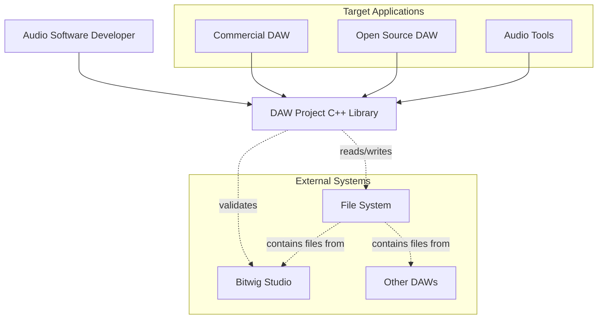

# Context View

## Purpose
Describes the system's external actors, systems, and boundaries (C4 Level 1).

## Primary Stakeholders
| Stakeholder | Concern |
|-------------|---------|
| Developer | Integration points |
| DAW Vendor | Compatibility |
| End User | Data integrity |

## Model

## Elements & Responsibilities
| ID | Element | Responsibility | Interfaces | Related Requirements |
|----|---------|---------------|-----------|----------------------|
| ARC-C-001 | Library | Project file I/O | C++/C API | REQ-FILE-001 |
| ARC-C-002 | FileSystem | Storage | N/A | REQ-FILE-001 |
| ARC-C-003 | Bitwig | Reference files | N/A | REQ-FILE-001 |

## Design Decisions Referenced
- ADR-001 Architecture style
- ADR-004 Dual API

## Quality Attribute Impact
Supports compatibility, integration, and data integrity.