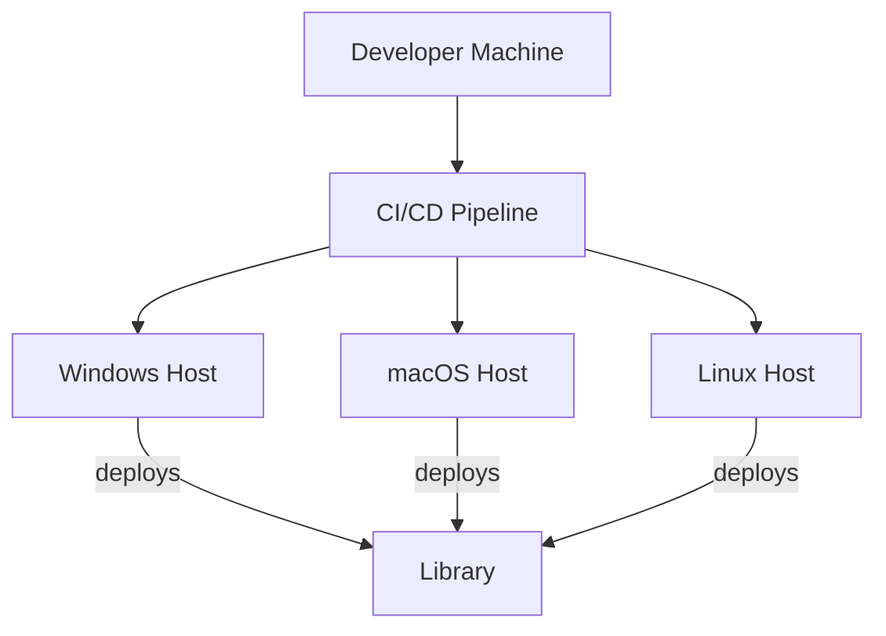

# Deployment View

## Purpose
Describes the physical deployment and infrastructure (C4 Deployment View).

## Primary Stakeholders
| Stakeholder | Concern |
|-------------|---------|
| DevOps | Deployment automation |
| Developer | Platform support |
| Maintainer | Upgradeability |

## Model

## Elements & Responsibilities
| ID | Element | Responsibility | Interfaces | Related Requirements |
|----|---------|---------------|-----------|----------------------|
| ARC-D-001 | Library | Deployable artifact | CMake, vcpkg | NFR-COMPAT-001 |
| ARC-D-002 | CI/CD | Automated build/test | GitHub Actions | NFR-BUILD-001 |
| ARC-D-003 | Host OS | Runtime environment | OS APIs | NFR-COMPAT-001 |

## Design Decisions Referenced
- ADR-008 Build system

## Quality Attribute Impact
Supports cross-platform deployment, automation, and maintainability.
