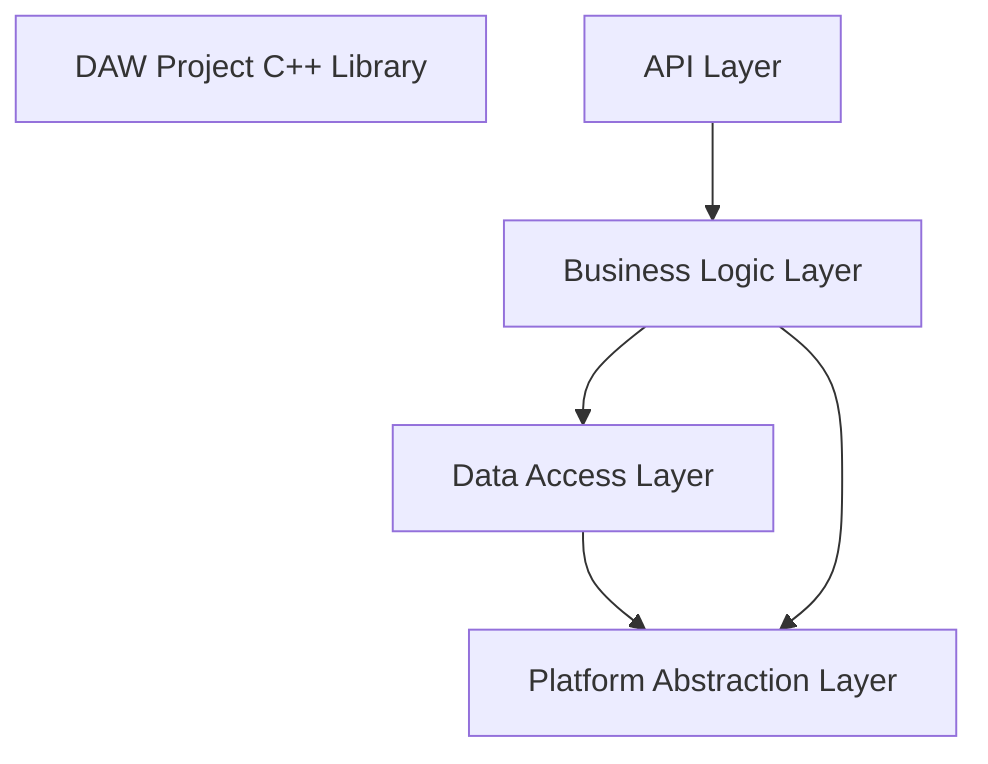

# Logical View

## Purpose
Describes the main functional decomposition and major components (C4 Level 2/3).

## Primary Stakeholders
| Stakeholder | Concern |
|-------------|---------|
| Developer | Maintainability |
| QA | Testability |
| Product Owner | Feature completeness |

## Model

## Elements & Responsibilities
| ID | Element | Responsibility | Interfaces | Related Requirements |
|----|---------|---------------|-----------|----------------------|
| ARC-L-001 | API Layer | Public API (C++/C) | DawProject, C API | REQ-FILE-001, US-001 |
| ARC-L-002 | Business Logic | Project model, validation | Internal | REQ-FILE-001, US-003 |
| ARC-L-003 | Data Access | XML/ZIP I/O | pugixml, minizip | REQ-FILE-001 |
| ARC-L-004 | Platform Abstraction | OS/file system | std::filesystem | NFR-COMPAT-001 |

## Design Decisions Referenced
- ADR-001 Architecture style
- ADR-002 XML parser
- ADR-003 ZIP library
- ADR-004 Dual API

## Quality Attribute Impact
Supports maintainability, testability, and cross-platform compatibility.
