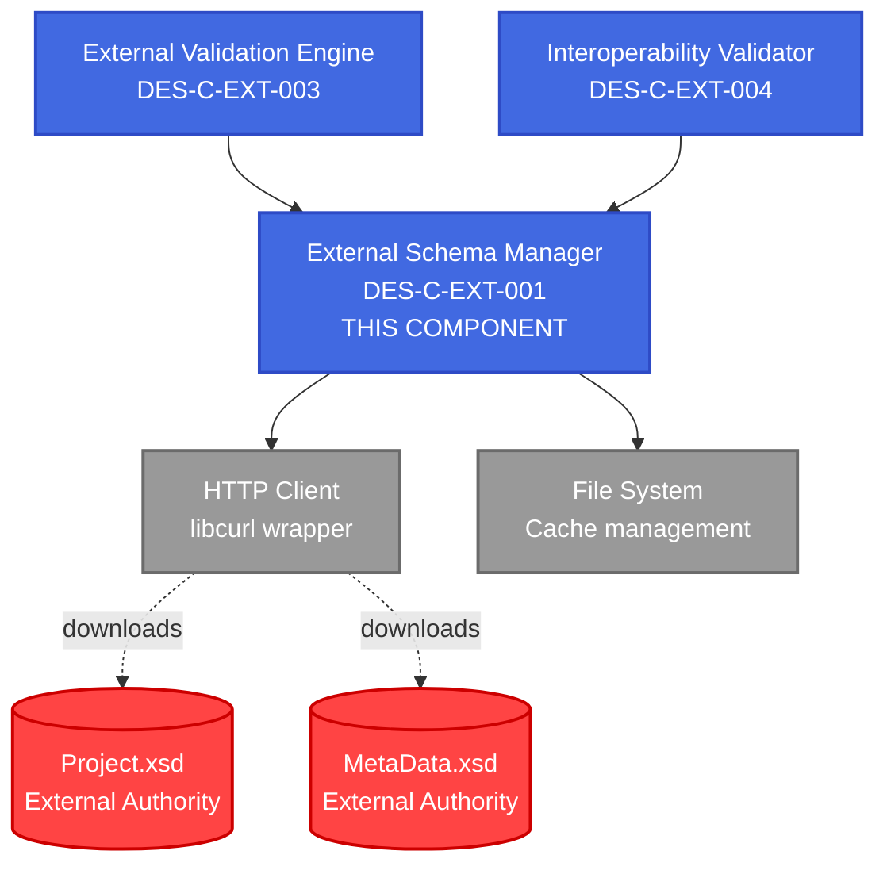
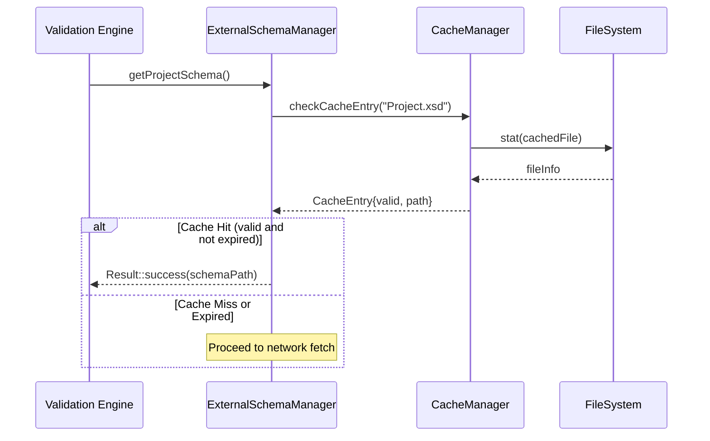
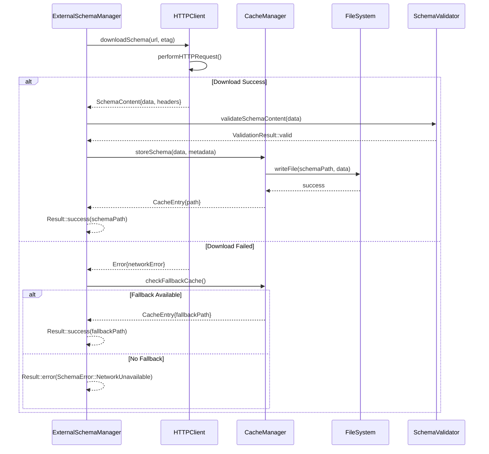

# Component Design Specification
## ExternalSchemaManager

**Document ID**: DES-C-EXT-001  
**Version**: 1.0  
**Date**: October 11, 2025  
**Status**: Draft  
**Phase**: 04 - Detailed Design  
**Traceability**: ARC-C-EXT-001 → DES-C-EXT-001

---

## 1. Component Identification (IEEE 1016-2009 Section 5.2)

### 1.1 Component Overview

**Component Name**: ExternalSchemaManager  
**Component ID**: DES-C-EXT-001  
**Component Type**: Service Component  
**Architecture Component**: ARC-C-EXT-001  

**Purpose**: Manages the lifecycle of external XSD schemas required for DAWProject validation, including discovery, download, caching, and version management while ensuring external authority compliance.

**Responsibilities**:
- Download XSD schemas from external DAWProject repository
- Cache schemas locally with version control and integrity verification
- Provide schema access interface for validation components
- Handle network failures with graceful degradation
- Ensure external authority compliance (no schema internalization)

### 1.2 Component Context



---

## 2. Component Interface Design (IEEE 1016-2009 Section 5.3)

### 2.1 Public Interface

```cpp
namespace dawproject {
namespace external {

/**
 * @brief Manages external XSD schema lifecycle with external authority compliance
 * 
 * Handles download, caching, and access to external DAWProject XSD schemas.
 * Ensures external authority compliance by never internalizing schemas.
 * 
 * @threadsafety Thread-safe for concurrent schema access
 * @performance Schema access: <100ms (cache hit), <5s (network fetch)
 * @reliability Graceful degradation when external schemas unavailable
 */
class IExternalSchemaManager {
public:
    virtual ~IExternalSchemaManager() = default;

    /**
     * @brief Get path to cached Project.xsd schema
     * @return Result<std::filesystem::path> Path to cached schema or error
     * @throws None (uses Result<T> pattern)
     * @performance <100ms (cached), <5s (network download)
     * @threadsafety Thread-safe
     */
    virtual Result<std::filesystem::path> getProjectSchema() = 0;

    /**
     * @brief Get path to cached MetaData.xsd schema  
     * @return Result<std::filesystem::path> Path to cached schema or error
     * @throws None (uses Result<T> pattern)
     * @performance <100ms (cached), <5s (network download)
     * @threadsafety Thread-safe
     */
    virtual Result<std::filesystem::path> getMetaDataSchema() = 0;

    /**
     * @brief Check for and download schema updates if needed
     * @return Result<bool> true if schemas were updated, false if current
     * @throws None (uses Result<T> pattern)
     * @performance <30s (includes network operations)
     * @threadsafety Thread-safe
     */
    virtual Result<bool> updateSchemasIfNeeded() = 0;

    /**
     * @brief Force refresh of all cached schemas
     * @return Result<void> Success or detailed error information
     * @throws None (uses Result<T> pattern)
     * @performance <30s (includes network operations)
     * @threadsafety Thread-safe
     */
    virtual Result<void> refreshSchemas() = 0;

    /**
     * @brief Clear local schema cache
     * @return Result<void> Success or error details
     * @throws None (uses Result<T> pattern)
     * @performance <1s (filesystem operations only)
     * @threadsafety Thread-safe
     */
    virtual Result<void> clearCache() = 0;

    /**
     * @brief Get current schema cache status and statistics
     * @return Result<SchemaCacheInfo> Cache information or error
     * @throws None (uses Result<T> pattern)
     * @performance <10ms (metadata access only)
     * @threadsafety Thread-safe
     */
    virtual Result<SchemaCacheInfo> getCacheInfo() = 0;
};

} // namespace external
} // namespace dawproject
```

### 2.2 Configuration Interface

```cpp
/**
 * @brief Configuration for external schema management
 * 
 * Controls behavior of external schema operations including
 * network timeouts, cache settings, and external authority URLs.
 */
struct ExternalSchemaConfig {
    // External Authority URLs (NEVER internalize these)
    std::string projectSchemaUrl = 
        "https://raw.githubusercontent.com/bitwig/dawproject/main/Project.xsd";
    std::string metaDataSchemaUrl = 
        "https://raw.githubusercontent.com/bitwig/dawproject/main/MetaData.xsd";
    
    // Cache settings
    std::filesystem::path cacheDirectory = "~/.dawproject_cpp/schemas/";
    std::chrono::hours cacheValidDuration{24}; // 24 hours
    size_t maxCacheSize = 10 * 1024 * 1024; // 10MB
    
    // Network settings
    std::chrono::seconds networkTimeout{30};
    size_t maxRetries = 3;
    std::chrono::seconds retryDelay{2};
    
    // Validation settings
    bool enableChecksumValidation = true;
    bool enableVersionValidation = true;
    bool requireExternalValidation = true;
    
    // Fallback behavior
    bool allowCachedFallback = true;
    bool allowEmbeddedFallback = false; // NEVER enable - violates external authority
};
```

### 2.3 Error Handling Interface

```cpp
/**
 * @brief Error codes for external schema operations
 */
enum class SchemaError {
    // Network errors
    NetworkUnavailable,
    NetworkTimeout, 
    SchemaNotFound,
    DownloadFailed,
    
    // Cache errors
    CacheCorrupted,
    CacheWriteFailed,
    CacheReadFailed,
    InsufficientSpace,
    
    // Validation errors
    InvalidSchema,
    ChecksumMismatch,
    VersionMismatch,
    
    // Authority compliance errors
    ExternalAuthorityViolation,
    SchemaInternalizationAttempt,
    
    // System errors
    FileSystemError,
    PermissionDenied,
    ConfigurationError
};

/**
 * @brief Detailed error information for schema operations
 */
struct SchemaErrorInfo {
    SchemaError errorCode;
    std::string message;
    std::string details;
    std::optional<std::string> url;
    std::optional<std::filesystem::path> filePath;
    std::chrono::system_clock::time_point timestamp;
    
    // Network-specific error details
    std::optional<long> httpStatusCode;
    std::optional<std::string> networkError;
    
    // Recovery suggestions
    std::vector<std::string> recoverySuggestions;
};
```

---

## 3. Data Model Design (IEEE 1016-2009 Section 5.4)

### 3.1 Schema Cache Data Model

```cpp
/**
 * @brief Information about cached schema file
 */
struct CachedSchema {
    std::filesystem::path filePath;
    std::string url;
    std::string version; // ETag or version identifier
    std::string checksum; // SHA-256 hash
    std::chrono::system_clock::time_point downloadTime;
    std::chrono::system_clock::time_point lastAccessed;
    size_t fileSize;
    bool isValid;
    
    // External authority compliance verification
    bool isFromExternalAuthority;
    std::string externalAuthoritySource;
};

/**
 * @brief Overall cache status and statistics
 */
struct SchemaCacheInfo {
    std::filesystem::path cacheDirectory;
    size_t totalCacheSize;
    size_t availableSpace;
    std::chrono::system_clock::time_point lastUpdate;
    
    // Individual schema information
    std::optional<CachedSchema> projectSchema;
    std::optional<CachedSchema> metaDataSchema;
    
    // Cache health metrics
    size_t cacheHits;
    size_t cacheMisses;
    size_t networkRequests;
    size_t failedRequests;
    
    // External authority compliance status
    bool externalAuthorityCompliant;
    std::vector<std::string> complianceViolations;
};
```

### 3.2 Network Operation Data Model

```cpp
/**
 * @brief Result of schema download operation
 */
struct SchemaDownloadResult {
    bool success;
    std::filesystem::path localPath;
    std::string version; // ETag or version from server
    std::string checksum; // Computed SHA-256
    size_t fileSize;
    std::chrono::milliseconds downloadDuration;
    
    // HTTP response details
    long httpStatusCode;
    std::map<std::string, std::string> responseHeaders;
    
    // Error information (if success == false)
    std::optional<SchemaErrorInfo> errorInfo;
};
```

---

## 4. Component Behavior Design (IEEE 1016-2009 Section 5.5)

### 4.1 State Machine Design

```mermaid
stateDiagram-v2
    [*] --> Uninitialized
    
    Uninitialized --> Initializing : configure()
    Initializing --> Ready : success
    Initializing --> Error : configuration_failed
    
    Ready --> CacheCheck : getSchema()
    CacheCheck --> CacheHit : schema_cached_and_valid
    CacheCheck --> NetworkFetch : cache_miss_or_expired
    
    CacheHit --> Ready : return_cached_schema
    
    NetworkFetch --> Downloading : start_download
    Downloading --> Validating : download_complete
    Downloading --> NetworkError : download_failed
    
    Validating --> CacheStore : validation_passed
    Validating --> ValidationError : validation_failed
    
    CacheStore --> Ready : cache_updated
    CacheStore --> CacheError : cache_write_failed
    
    NetworkError --> FallbackCheck : check_fallback_options
    ValidationError --> FallbackCheck : check_fallback_options
    CacheError --> FallbackCheck : check_fallback_options
    
    FallbackCheck --> CacheHit : cached_version_available
    FallbackCheck --> Error : no_fallback_available
    
    Error --> Ready : retry_operation
    Ready --> [*] : shutdown
```



### 4.2 Sequence Diagrams

#### Schema Access with Cache Hit



#### Schema Download and Cache Update



### 4.3 Algorithm Specifications

#### Cache Validation Algorithm

```cpp
/**
 * @brief Algorithm for validating cached schema entries
 * 
 * Validates that cached schema is:
 * 1. Present and readable
 * 2. Not expired based on cache duration
 * 3. Integrity verified via checksum
 * 4. From external authority (compliance check)
 * 
 * @complexity O(1) for metadata check, O(n) for checksum validation
 */
bool validateCacheEntry(const CachedSchema& entry, 
                       const ExternalSchemaConfig& config) {
    // Step 1: File existence and readability
    if (!std::filesystem::exists(entry.filePath) || 
        !std::filesystem::is_regular_file(entry.filePath)) {
        return false;
    }
    
    // Step 2: Expiration check
    auto age = std::chrono::system_clock::now() - entry.downloadTime;
    if (age > config.cacheValidDuration) {
        return false;
    }
    
    // Step 3: Integrity verification (if enabled)
    if (config.enableChecksumValidation) {
        std::string currentChecksum = computeFileChecksum(entry.filePath);
        if (currentChecksum != entry.checksum) {
            return false;
        }
    }
    
    // Step 4: External authority compliance
    if (config.requireExternalValidation && !entry.isFromExternalAuthority) {
        return false;
    }
    
    return true;
}
```

#### Network Retry Algorithm

```cpp
/**
 * @brief Exponential backoff retry algorithm for network operations
 * 
 * Implements exponential backoff with jitter for robust network operations:
 * - Initial delay: retryDelay
 * - Exponential factor: 2.0
 * - Maximum delay: 60 seconds
 * - Jitter: ±25% random variation
 * 
 * @complexity O(1) per retry attempt
 */
template<typename Operation>
Result<typename Operation::return_type> 
executeWithRetry(Operation&& op, const ExternalSchemaConfig& config) {
    std::random_device rd;
    std::mt19937 gen(rd());
    
    for (size_t attempt = 0; attempt < config.maxRetries; ++attempt) {
        auto result = op();
        
        if (result.isSuccess()) {
            return result;
        }
        
        // Don't retry on certain error types
        if (result.error().errorCode == SchemaError::SchemaNotFound ||
            result.error().errorCode == SchemaError::ExternalAuthorityViolation) {
            return result;
        }
        
        // Calculate delay with exponential backoff and jitter
        if (attempt < config.maxRetries - 1) {
            auto baseDelay = config.retryDelay * std::pow(2.0, attempt);
            auto maxDelay = std::min(baseDelay, std::chrono::seconds{60});
            
            // Add jitter (±25%)
            std::uniform_real_distribution<> jitter(0.75, 1.25);
            auto finalDelay = std::chrono::duration_cast<std::chrono::milliseconds>(
                maxDelay * jitter(gen)
            );
            
            std::this_thread::sleep_for(finalDelay);
        }
    }
    
    return Result<typename Operation::return_type>::error(
        SchemaErrorInfo{SchemaError::NetworkTimeout, 
                       "All retry attempts exhausted", 
                       "Network operation failed after " + 
                       std::to_string(config.maxRetries) + " attempts"}
    );
}
```

---

## 5. Implementation Constraints (IEEE 1016-2009 Section 5.6)

### 5.1 Performance Constraints

| Operation | Performance Requirement | Rationale |
|-----------|------------------------|-----------|
| **Cached Schema Access** | <100ms | Real-time validation needs |
| **Network Schema Download** | <5s | User experience threshold |
| **Cache Validation** | <10ms | Frequent operation overhead |
| **Checksum Computation** | <1s for 1MB schema | Security requirement |
| **Memory Usage** | <50MB total cache | Resource constraints |

### 5.2 Reliability Constraints

| Aspect | Requirement | Implementation |
|--------|-------------|----------------|
| **Network Resilience** | 99% uptime with fallback | Cache fallback + retry logic |
| **Data Integrity** | 100% checksum validation | SHA-256 verification |
| **External Authority Compliance** | 100% compliance | No schema internalization |
| **Thread Safety** | Concurrent access support | Read-write locks + atomic operations |
| **Error Recovery** | Graceful degradation | Fallback chain with clear error reporting |

### 5.3 Platform Constraints

```cpp
// Platform-specific considerations
#ifdef _WIN32
    // Windows-specific cache directory: %APPDATA%/dawproject_cpp/schemas
    std::filesystem::path getDefaultCacheDir() {
        auto appdata = std::getenv("APPDATA");
        return std::filesystem::path(appdata) / "dawproject_cpp" / "schemas";
    }
#elif defined(__APPLE__)
    // macOS-specific cache directory: ~/Library/Caches/dawproject_cpp/schemas
    std::filesystem::path getDefaultCacheDir() {
        auto home = std::getenv("HOME");
        return std::filesystem::path(home) / "Library" / "Caches" / 
               "dawproject_cpp" / "schemas";
    }
#else
    // Linux/Unix cache directory: ~/.cache/dawproject_cpp/schemas
    std::filesystem::path getDefaultCacheDir() {
        auto home = std::getenv("HOME");
        return std::filesystem::path(home) / ".cache" / "dawproject_cpp" / "schemas";
    }
#endif
```

---

## 6. Test-Driven Design Preparation (XP Practice Integration)

### 6.1 Test Interface Design

```cpp
/**
 * @brief Mock interface for TDD of ExternalSchemaManager
 * 
 * Enables testing without network dependencies or filesystem operations
 */
class MockExternalSchemaManager : public IExternalSchemaManager {
public:
    // Mock behaviors for different test scenarios
    void setNetworkBehavior(NetworkBehavior behavior);
    void setCacheBehavior(CacheBehavior behavior);
    void setSchemaContent(const std::string& schemaType, const std::string& content);
    
    // Verification methods for test assertions
    bool wasNetworkAccessAttempted() const;
    size_t getNetworkRequestCount() const;
    std::vector<std::string> getRequestedUrls() const;
    
    // IExternalSchemaManager implementation with controllable behavior
    Result<std::filesystem::path> getProjectSchema() override;
    Result<std::filesystem::path> getMetaDataSchema() override;
    Result<bool> updateSchemasIfNeeded() override;
    Result<void> refreshSchemas() override;
    Result<void> clearCache() override;
    Result<SchemaCacheInfo> getCacheInfo() override;
};
```

### 6.2 Test Scenarios for TDD

#### Test Category 1: Happy Path Scenarios

```cpp
// Test: Successful schema access with valid cache
TEST_CASE("ExternalSchemaManager returns cached schema when valid") {
    auto mockManager = std::make_unique<MockExternalSchemaManager>();
    mockManager->setCacheBehavior(CacheBehavior::ValidCacheHit);
    
    auto result = mockManager->getProjectSchema();
    
    REQUIRE(result.isSuccess());
    REQUIRE(std::filesystem::exists(result.value()));
    REQUIRE_FALSE(mockManager->wasNetworkAccessAttempted());
}

// Test: Successful schema download when cache miss
TEST_CASE("ExternalSchemaManager downloads schema on cache miss") {
    auto mockManager = std::make_unique<MockExternalSchemaManager>();
    mockManager->setCacheBehavior(CacheBehavior::CacheMiss);
    mockManager->setNetworkBehavior(NetworkBehavior::Success);
    
    auto result = mockManager->getProjectSchema();
    
    REQUIRE(result.isSuccess());
    REQUIRE(mockManager->wasNetworkAccessAttempted());
    REQUIRE(mockManager->getNetworkRequestCount() == 1);
}
```

#### Test Category 2: Error Handling Scenarios

```cpp
// Test: Network failure with cache fallback
TEST_CASE("ExternalSchemaManager uses cache fallback on network failure") {
    auto mockManager = std::make_unique<MockExternalSchemaManager>();
    mockManager->setCacheBehavior(CacheBehavior::ExpiredButUsableFallback);
    mockManager->setNetworkBehavior(NetworkBehavior::NetworkError);
    
    auto result = mockManager->getProjectSchema();
    
    REQUIRE(result.isSuccess());
    REQUIRE(mockManager->wasNetworkAccessAttempted());
}

// Test: Complete failure scenario
TEST_CASE("ExternalSchemaManager returns error when no fallback available") {
    auto mockManager = std::make_unique<MockExternalSchemaManager>();
    mockManager->setCacheBehavior(CacheBehavior::NoCache);
    mockManager->setNetworkBehavior(NetworkBehavior::NetworkError);
    
    auto result = mockManager->getProjectSchema();
    
    REQUIRE_FALSE(result.isSuccess());
    REQUIRE(result.error().errorCode == SchemaError::NetworkUnavailable);
}
```

#### Test Category 3: External Authority Compliance

```cpp
// Test: External authority URL compliance
TEST_CASE("ExternalSchemaManager only accesses external authority URLs") {
    auto mockManager = std::make_unique<MockExternalSchemaManager>();
    mockManager->setNetworkBehavior(NetworkBehavior::Success);
    
    mockManager->getProjectSchema();
    mockManager->getMetaDataSchema();
    
    auto urls = mockManager->getRequestedUrls();
    REQUIRE(std::all_of(urls.begin(), urls.end(), [](const auto& url) {
        return url.find("github.com/bitwig/dawproject") != std::string::npos;
    }));
}

// Test: Schema internalization prevention
TEST_CASE("ExternalSchemaManager prevents schema internalization") {
    // This test ensures that schemas are never copied into the repository
    // or embedded as static data, maintaining external authority compliance
    
    auto config = ExternalSchemaConfig{};
    config.allowEmbeddedFallback = true; // This should trigger compliance error
    
    auto manager = createExternalSchemaManager(config);
    auto result = manager->getProjectSchema();
    
    // Should fail with external authority violation
    REQUIRE_FALSE(result.isSuccess());
    REQUIRE(result.error().errorCode == SchemaError::ExternalAuthorityViolation);
}
```

### 6.3 Refactoring Readiness

The design supports XP refactoring practices through:

1. **Interface Segregation**: Small, focused interfaces easy to change
2. **Dependency Injection**: All dependencies injected for easy swapping
3. **Result Pattern**: Consistent error handling without exceptions
4. **Immutable Data**: Most data structures are immutable after creation
5. **Clear Separation**: Network, cache, and validation concerns separated

---

## 7. Implementation Guidance

### 7.1 Implementation Priority

1. **Phase 1**: Basic interface and configuration structure
2. **Phase 2**: Cache management with filesystem operations
3. **Phase 3**: HTTP client integration with retry logic
4. **Phase 4**: Schema validation and integrity checking
5. **Phase 5**: Error handling and fallback mechanisms
6. **Phase 6**: Performance optimization and thread safety

### 7.2 Key Implementation Files

```
05-implementation/
├── include/dawproject/external/
│   ├── IExternalSchemaManager.h          # Public interface
│   ├── ExternalSchemaConfig.h            # Configuration structures
│   └── SchemaError.h                     # Error handling types
├── src/external/
│   ├── ExternalSchemaManager.cpp         # Main implementation
│   ├── SchemaCacheManager.cpp            # Cache operations
│   ├── SchemaDownloader.cpp              # Network operations
│   └── SchemaValidator.cpp               # Validation logic
└── tests/unit/external/
    ├── test_ExternalSchemaManager.cpp    # Unit tests
    ├── MockExternalSchemaManager.cpp     # Test doubles
    └── test_SchemaCaching.cpp            # Cache-specific tests
```

---

## 8. Traceability (IEEE 1016-2009 Section 5.8)

### 8.1 Requirements Traceability

| Requirement ID | Design Element | Implementation Notes |
|----------------|----------------|----------------------|
| REQ-EXT-001 | IExternalSchemaManager::getProjectSchema() | External Project.xsd validation |
| REQ-EXT-001 | IExternalSchemaManager::getMetaDataSchema() | External MetaData.xsd validation |
| REQ-EXT-002 | SchemaCacheManager | Local caching without internalization |
| REQ-EXT-002 | SchemaDownloader | Network download operations |

### 8.2 Architecture Traceability

| Architecture Component | Design Component | Interface |
|------------------------|------------------|-----------|
| ARC-C-EXT-001 | DES-C-EXT-001 | IExternalSchemaManager |
| External HTTP Client | SchemaDownloader | HTTP operations |
| External File Cache | SchemaCacheManager | Cache operations |

### 8.3 ADR Traceability

| ADR ID | Design Decision | Implementation Impact |
|--------|-----------------|----------------------|
| ADR-009 | External Schema Management Strategy | Complete component design |
| ADR-011 | Build Dependencies | libcurl integration requirement |
| ADR-002 | Dual XML Processing | Integration with validation engine |

---

*This component design specification provides the detailed foundation for implementing the ExternalSchemaManager component in Phase 05, ensuring external authority compliance, performance requirements, and XP practices alignment.*