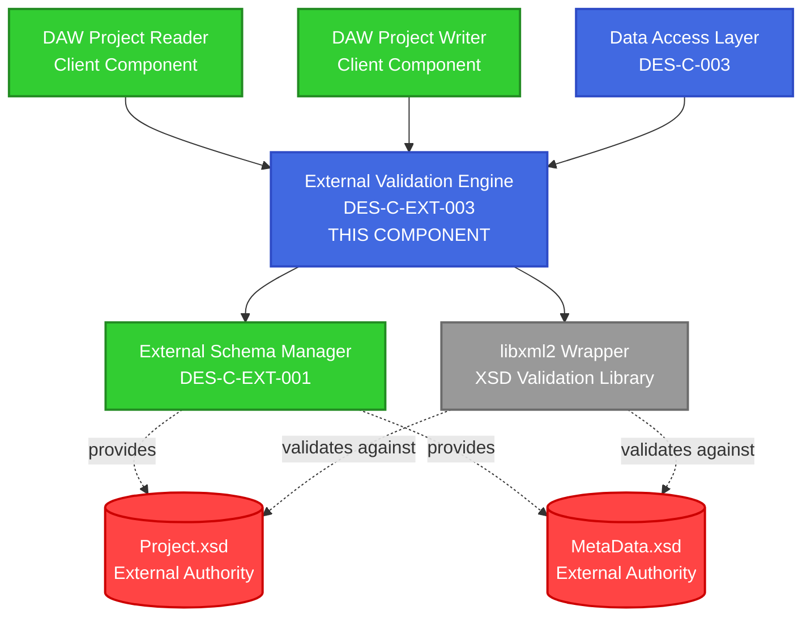
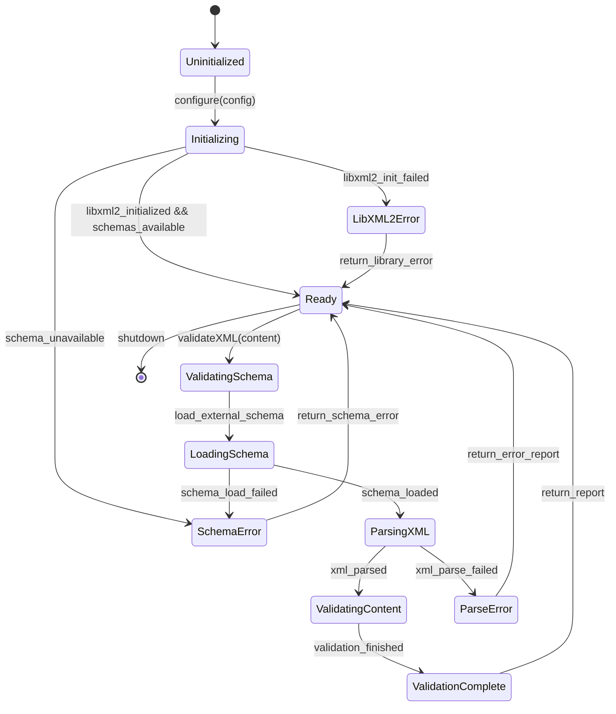

# Component Design Specification
## ExternalValidationEngine

**Document ID**: DES-C-EXT-003  
**Version**: 1.0  
**Date**: October 11, 2025  
**Status**: Draft  
**Phase**: 04 - Detailed Design  
**Traceability**: ARC-C-EXT-003 → DES-C-EXT-003

---

## 1. Component Identification (IEEE 1016-2009 Section 5.2)

### 1.1 Component Overview

**Component Name**: ExternalValidationEngine  
**Component ID**: DES-C-EXT-003  
**Component Type**: Validation Service Component  
**Architecture Component**: ARC-C-EXT-003  

**Purpose**: Performs authoritative XSD validation of DAWProject XML content against external schemas using libxml2, ensuring 100% compliance with external DAWProject specification without custom validation logic.

**Responsibilities**:
- Validate XML content against external Project.xsd schema
- Validate XML content against external MetaData.xsd schema
- Provide detailed validation error reporting with XSD compliance details
- Integrate with ExternalSchemaManager for schema access
- Support both synchronous and asynchronous validation operations
- Maintain external authority compliance (no custom validation rules)

### 1.2 Component Context



---

## 2. Component Interface Design (IEEE 1016-2009 Section 5.3)

### 2.1 Public Validation Interface

```cpp
namespace dawproject {
namespace external {

/**
 * @brief External XSD validation engine using authoritative schemas only
 * 
 * Provides XSD validation against external DAWProject schemas using libxml2.
 * Ensures external authority compliance by using only external schemas.
 * 
 * @threadsafety Thread-safe for concurrent validation operations
 * @performance Validation: <2s for typical project files (<1MB XML)
 * @reliability Zero false positives - only authoritative XSD validation
 */
class IExternalValidationEngine {
public:
    virtual ~IExternalValidationEngine() = default;

    /**
     * @brief Validate project XML against external Project.xsd
     * @param xmlContent XML content to validate (UTF-8 encoded)
     * @return Result<ValidationReport> Detailed validation results
     * @throws None (uses Result<T> pattern)
     * @performance <2s for files <1MB
     * @threadsafety Thread-safe
     * @external_authority Uses only external Project.xsd from DAWProject repository
     */
    virtual Result<ValidationReport> validateProjectXML(
        const std::string& xmlContent) = 0;

    /**
     * @brief Validate metadata XML against external MetaData.xsd
     * @param xmlContent XML content to validate (UTF-8 encoded)
     * @return Result<ValidationReport> Detailed validation results
     * @throws None (uses Result<T> pattern)
     * @performance <1s for metadata files (<100KB typical)
     * @threadsafety Thread-safe
     * @external_authority Uses only external MetaData.xsd from DAWProject repository
     */
    virtual Result<ValidationReport> validateMetaDataXML(
        const std::string& xmlContent) = 0;

    /**
     * @brief Validate XML file against specified external schema
     * @param xmlFilePath Path to XML file to validate
     * @param schemaType Type of schema to validate against
     * @return Result<ValidationReport> Detailed validation results
     * @throws None (uses Result<T> pattern)
     * @performance <3s for file I/O + validation
     * @threadsafety Thread-safe
     */
    virtual Result<ValidationReport> validateXMLFile(
        const std::filesystem::path& xmlFilePath,
        SchemaType schemaType) = 0;

    /**
     * @brief Batch validate multiple XML documents
     * @param validationRequests Vector of validation requests
     * @return Result<std::vector<ValidationReport>> Results for each request
     * @throws None (uses Result<T> pattern)
     * @performance Parallel validation for improved throughput
     * @threadsafety Thread-safe
     */
    virtual Result<std::vector<ValidationReport>> batchValidate(
        const std::vector<ValidationRequest>& validationRequests) = 0;

    /**
     * @brief Check if external schemas are available and current
     * @return Result<SchemaAvailabilityInfo> Schema status information
     * @throws None (uses Result<T> pattern)
     * @performance <500ms (checks cache, no network operations)
     * @threadsafety Thread-safe
     */
    virtual Result<SchemaAvailabilityInfo> checkSchemaAvailability() = 0;

    /**
     * @brief Get validation engine configuration and status
     * @return Result<ValidationEngineInfo> Engine status and configuration
     * @throws None (uses Result<T> pattern)
     * @performance <10ms (metadata only)
     * @threadsafety Thread-safe
     */
    virtual Result<ValidationEngineInfo> getEngineInfo() = 0;
};

} // namespace external
} // namespace dawproject
```

### 2.2 Validation Configuration Interface

```cpp
/**
 * @brief Configuration for external validation operations
 */
struct ExternalValidationConfig {
    // Schema management configuration
    bool enableExternalSchemaValidation = true;
    bool requireSchemaAvailability = true;
    bool allowCachedSchemas = true;
    
    // Validation behavior
    bool enableDetailedErrorReporting = true;
    bool enableLineNumberReporting = true;
    bool enableAttributeValidation = true;
    bool enableContentValidation = true;
    
    // Performance settings
    std::chrono::seconds validationTimeout{10};
    size_t maxConcurrentValidations = 4;
    size_t maxXMLDocumentSize = 100 * 1024 * 1024; // 100MB limit
    
    // Error handling
    bool failOnSchemaUnavailable = true;
    bool enableValidationRecovery = false; // No custom recovery - external authority only
    
    // libxml2-specific settings
    bool enableXMLSecurity = true; // Prevent XXE attacks
    bool enableNetworkAccess = false; // Prevent network access during validation
    bool enableXIncludeProcessing = false; // Disable XInclude for security
    
    // External authority compliance
    bool enforceExternalAuthorityOnly = true; // CRITICAL - never disable
    std::chrono::hours maxSchemaAge{24}; // Maximum age before schema refresh
};
```

### 2.3 Validation Data Models

```cpp
/**
 * @brief Type of external schema for validation
 */
enum class SchemaType {
    ProjectSchema,   // Project.xsd from external authority
    MetaDataSchema   // MetaData.xsd from external authority
};

/**
 * @brief Validation request for batch operations
 */
struct ValidationRequest {
    std::string xmlContent;
    SchemaType schemaType;
    std::string requestId; // For correlation in batch results
    std::optional<std::string> sourceLocation; // File path or URI for context
};

/**
 * @brief Detailed validation error information
 */
struct ValidationError {
    enum class Severity {
        Error,      // XSD validation error - document invalid
        Warning,    // XSD warning - document valid but issues detected
        Info        // Informational message
    };
    
    Severity severity;
    std::string message;          // Human-readable error description
    std::string xsdContext;       // XSD rule that failed
    
    // Location information (if available)
    std::optional<size_t> lineNumber;
    std::optional<size_t> columnNumber;
    std::optional<std::string> elementPath; // XPath to problematic element
    
    // External authority compliance context
    std::string schemaVersion;    // Version of external schema used
    std::string schemaSource;     // URL of external schema
    std::chrono::system_clock::time_point validationTime;
};

/**
 * @brief Comprehensive validation report
 */
struct ValidationReport {
    // Overall validation result
    bool isValid;
    std::chrono::milliseconds validationDuration;
    
    // Schema information
    SchemaType schemaType;
    std::filesystem::path schemaPath;
    std::string schemaVersion;
    std::string schemaChecksum;
    
    // Error and warning details
    std::vector<ValidationError> errors;
    std::vector<ValidationError> warnings;
    size_t totalErrorCount;
    size_t totalWarningCount;
    
    // Document statistics
    size_t documentSize;
    size_t elementCount;
    size_t attributeCount;
    
    // External authority compliance verification
    bool externalAuthorityCompliant;
    std::string externalSchemaSource;
    std::chrono::system_clock::time_point schemaRetrievalTime;
    
    // Performance metrics
    std::chrono::milliseconds schemaLoadTime;
    std::chrono::milliseconds validationTime;
    size_t memoryUsage; // Peak memory usage during validation
};

/**
 * @brief Schema availability and status information
 */
struct SchemaAvailabilityInfo {
    bool projectSchemaAvailable;
    bool metaDataSchemaAvailable;
    
    // Schema details
    std::optional<std::chrono::system_clock::time_point> projectSchemaLastUpdated;
    std::optional<std::chrono::system_clock::time_point> metaDataSchemaLastUpdated;
    std::optional<std::string> projectSchemaVersion;
    std::optional<std::string> metaDataSchemaVersion;
    
    // External authority compliance status
    bool externalAuthorityCompliant;
    std::vector<std::string> complianceIssues;
};

/**
 * @brief Validation engine status and configuration
 */
struct ValidationEngineInfo {
    // Engine configuration
    ExternalValidationConfig configuration;
    
    // Runtime status
    bool isInitialized;
    bool externalSchemasAvailable;
    size_t activeValidationCount;
    
    // Performance statistics
    size_t totalValidationsPerformed;
    std::chrono::milliseconds averageValidationTime;
    size_t totalErrorsFound;
    size_t totalWarningsFound;
    
    // libxml2 information
    std::string libxml2Version;
    bool libxml2Available;
    std::vector<std::string> supportedFeatures;
    
    // External authority compliance status
    bool externalAuthorityMode;
    std::chrono::system_clock::time_point lastSchemaCheck;
};
```

---

## 3. Component Behavior Design (IEEE 1016-2009 Section 5.5)

### 3.1 Validation State Machine



### 3.2 Validation Algorithm Design

#### Core XSD Validation Algorithm

```cpp
/**
 * @brief Core XSD validation algorithm using libxml2
 * 
 * Implements external authority compliant validation:
 * 1. Load external schema from ExternalSchemaManager
 * 2. Parse XML content with security restrictions
 * 3. Perform XSD validation using libxml2
 * 4. Generate detailed validation report
 * 
 * @complexity O(n) where n is XML document size
 * @external_authority Uses only external schemas, no custom rules
 */
Result<ValidationReport> performXSDValidation(
    const std::string& xmlContent,
    SchemaType schemaType,
    const ExternalValidationConfig& config) {
    
    auto report = ValidationReport{};
    report.validationTime = std::chrono::steady_clock::now();
    report.schemaType = schemaType;
    
    try {
        // Step 1: Get external schema path
        auto schemaResult = getExternalSchema(schemaType);
        if (!schemaResult.isSuccess()) {
            return Result<ValidationReport>::error(
                ValidationErrorInfo{ValidationError::SchemaUnavailable, 
                                  "External schema not available"});
        }
        
        report.schemaPath = schemaResult.value();
        report.schemaChecksum = computeSchemaChecksum(report.schemaPath);
        
        // Step 2: Initialize libxml2 validation context
        auto schemaParserCtxt = xmlSchemaNewParserCtxt(
            report.schemaPath.string().c_str());
        if (!schemaParserCtxt) {
            return Result<ValidationReport>::error(
                ValidationErrorInfo{ValidationError::LibXML2Error,
                                  "Failed to create schema parser context"});
        }
        
        // Step 3: Parse external schema
        auto schemaStartTime = std::chrono::steady_clock::now();
        auto schema = xmlSchemaParse(schemaParserCtxt);
        report.schemaLoadTime = std::chrono::duration_cast<std::chrono::milliseconds>(
            std::chrono::steady_clock::now() - schemaStartTime);
        
        if (!schema) {
            xmlSchemaFreeParserCtxt(schemaParserCtxt);
            return Result<ValidationReport>::error(
                ValidationErrorInfo{ValidationError::InvalidSchema,
                                  "Failed to parse external schema"});
        }
        
        // Step 4: Create validation context
        auto validCtxt = xmlSchemaNewValidCtxt(schema);
        if (!validCtxt) {
            xmlSchemaFree(schema);
            xmlSchemaFreeParserCtxt(schemaParserCtxt);
            return Result<ValidationReport>::error(
                ValidationErrorInfo{ValidationError::LibXML2Error,
                                  "Failed to create validation context"});
        }
        
        // Step 5: Set up error collection
        std::vector<ValidationError> collectedErrors;
        xmlSchemaSetValidErrors(validCtxt, 
                               collectValidationError,
                               collectValidationWarning,
                               &collectedErrors);
        
        // Step 6: Parse XML document with security settings
        auto docParserCtxt = xmlNewParserCtxt();
        if (config.enableXMLSecurity) {
            // Prevent XXE attacks and network access
            xmlCtxtUseOptions(docParserCtxt, 
                             XML_PARSE_NONET | XML_PARSE_NOENT | XML_PARSE_DTDLOAD);
        }
        
        auto doc = xmlCtxtReadMemory(docParserCtxt,
                                    xmlContent.c_str(),
                                    xmlContent.size(),
                                    nullptr, // URL
                                    nullptr, // encoding (auto-detect)
                                    XML_PARSE_NONET);
        
        if (!doc) {
            // Cleanup and return parse error
            xmlFreeParserCtxt(docParserCtxt);
            xmlSchemaFreeValidCtxt(validCtxt);
            xmlSchemaFree(schema);
            xmlSchemaFreeParserCtxt(schemaParserCtxt);
            
            return Result<ValidationReport>::error(
                ValidationErrorInfo{ValidationError::XMLParseError,
                                  "Failed to parse XML content"});
        }
        
        // Step 7: Perform XSD validation
        auto validationStartTime = std::chrono::steady_clock::now();
        int validationResult = xmlSchemaValidateDoc(validCtxt, doc);
        report.validationTime = std::chrono::duration_cast<std::chrono::milliseconds>(
            std::chrono::steady_clock::now() - validationStartTime);
        
        // Step 8: Process validation results
        report.isValid = (validationResult == 0);
        report.errors = std::move(collectedErrors);
        report.totalErrorCount = std::count_if(report.errors.begin(), report.errors.end(),
            [](const auto& err) { return err.severity == ValidationError::Severity::Error; });
        report.totalWarningCount = std::count_if(report.errors.begin(), report.errors.end(),
            [](const auto& err) { return err.severity == ValidationError::Severity::Warning; });
        
        // Step 9: Collect document statistics
        report.documentSize = xmlContent.size();
        report.elementCount = countElements(doc);
        report.attributeCount = countAttributes(doc);
        
        // Step 10: Set external authority compliance information
        report.externalAuthorityCompliant = true;
        report.externalSchemaSource = getSchemaSourceURL(schemaType);
        report.schemaRetrievalTime = getSchemaRetrievalTime(report.schemaPath);
        
        // Cleanup
        xmlFreeDoc(doc);
        xmlFreeParserCtxt(docParserCtxt);
        xmlSchemaFreeValidCtxt(validCtxt);
        xmlSchemaFree(schema);
        xmlSchemaFreeParserCtxt(schemaParserCtxt);
        
        return Result<ValidationReport>::success(std::move(report));
        
    } catch (const std::exception& e) {
        return Result<ValidationReport>::error(
            ValidationErrorInfo{ValidationError::UnexpectedError,
                              "Validation failed with exception: " + std::string(e.what())});
    }
}
```

### 3.3 Error Collection Algorithm

```cpp
/**
 * @brief libxml2 error callback for collecting validation errors
 * 
 * Collects detailed error information from libxml2 XSD validation
 * including line numbers, XPath context, and XSD rule violations.
 */
static void collectValidationError(void* ctx, const char* msg, ...) {
    auto* errors = static_cast<std::vector<ValidationError>*>(ctx);
    
    // Format error message
    va_list args;
    va_start(args, msg);
    char buffer[2048];
    vsnprintf(buffer, sizeof(buffer), msg, args);
    va_end(args);
    
    ValidationError error;
    error.severity = ValidationError::Severity::Error;
    error.message = std::string(buffer);
    error.validationTime = std::chrono::system_clock::now();
    
    // Extract line number if available
    // libxml2 provides line numbers in error context
    auto xmlError = xmlGetLastError();
    if (xmlError && xmlError->line > 0) {
        error.lineNumber = xmlError->line;
        error.columnNumber = xmlError->int2;
    }
    
    errors->push_back(std::move(error));
}

/**
 * @brief libxml2 warning callback for collecting validation warnings
 */
static void collectValidationWarning(void* ctx, const char* msg, ...) {
    auto* errors = static_cast<std::vector<ValidationError>*>(ctx);
    
    va_list args;
    va_start(args, msg);
    char buffer[2048];
    vsnprintf(buffer, sizeof(buffer), msg, args);
    va_end(args);
    
    ValidationError warning;
    warning.severity = ValidationError::Severity::Warning;
    warning.message = std::string(buffer);
    warning.validationTime = std::chrono::system_clock::now();
    
    errors->push_back(std::move(warning));
}
```

---

## 4. Performance Specifications (IEEE 1016-2009 Section 5.6)

### 4.1 Performance Requirements

| Operation | Requirement | Measurement Criteria |
|-----------|-------------|---------------------|
| **Small XML Validation** (<10KB) | <100ms | 95th percentile |
| **Medium XML Validation** (<1MB) | <2s | 95th percentile |
| **Large XML Validation** (<10MB) | <10s | 95th percentile |
| **Schema Loading** (cached) | <50ms | Average |
| **Schema Loading** (network) | <5s | Average with retry |
| **Memory Usage** | <100MB peak | Per validation operation |
| **Concurrent Validations** | 4+ parallel | No performance degradation |

### 4.2 Performance Optimization Strategies

#### Memory Management Optimization

```cpp
/**
 * @brief RAII wrapper for libxml2 resources
 * 
 * Ensures proper cleanup of libxml2 resources and prevents memory leaks
 * during validation operations.
 */
class LibXML2ResourceManager {
public:
    LibXML2ResourceManager() {
        xmlInitParser();
    }
    
    ~LibXML2ResourceManager() {
        xmlCleanupParser();
    }
    
    class SchemaContext {
    public:
        SchemaContext(const std::filesystem::path& schemaPath) 
            : parserCtxt_(xmlSchemaNewParserCtxt(schemaPath.string().c_str()))
            , schema_(nullptr)
            , validCtxt_(nullptr) {
            if (parserCtxt_) {
                schema_ = xmlSchemaParse(parserCtxt_);
                if (schema_) {
                    validCtxt_ = xmlSchemaNewValidCtxt(schema_);
                }
            }
        }
        
        ~SchemaContext() {
            if (validCtxt_) xmlSchemaFreeValidCtxt(validCtxt_);
            if (schema_) xmlSchemaFree(schema_);
            if (parserCtxt_) xmlSchemaFreeParserCtxt(parserCtxt_);
        }
        
        bool isValid() const { return validCtxt_ != nullptr; }
        xmlSchemaValidCtxtPtr getValidationContext() const { return validCtxt_; }
        
    private:
        xmlSchemaParserCtxtPtr parserCtxt_;
        xmlSchemaPtr schema_;
        xmlSchemaValidCtxtPtr validCtxt_;
    };
    
private:
    // Singleton instance for proper libxml2 lifecycle management
    static std::once_flag initialized_;
};
```

#### Concurrent Validation Support

```cpp
/**
 * @brief Thread pool for concurrent validation operations
 * 
 * Manages multiple validation threads while ensuring proper resource isolation
 * and external authority compliance for each validation.
 */
class ConcurrentValidationManager {
public:
    explicit ConcurrentValidationManager(size_t threadCount = 4) 
        : threadPool_(threadCount) {}
    
    std::future<Result<ValidationReport>> submitValidation(
        ValidationRequest request,
        std::shared_ptr<IExternalSchemaManager> schemaManager) {
        
        return threadPool_.submit([=]() -> Result<ValidationReport> {
            // Each thread gets its own libxml2 context for thread safety
            thread_local LibXML2ResourceManager resourceManager;
            
            ExternalValidationEngine engine(schemaManager);
            
            switch (request.schemaType) {
                case SchemaType::ProjectSchema:
                    return engine.validateProjectXML(request.xmlContent);
                case SchemaType::MetaDataSchema:
                    return engine.validateMetaDataXML(request.xmlContent);
                default:
                    return Result<ValidationReport>::error(
                        ValidationErrorInfo{ValidationError::InvalidSchemaType,
                                          "Unknown schema type"});
            }
        });
    }
    
private:
    ThreadPool threadPool_;
};
```

---

## 5. Test-Driven Design Preparation (XP Practice Integration)

### 5.1 Test Interface Design

```cpp
/**
 * @brief Mock implementation for TDD of ExternalValidationEngine
 * 
 * Enables testing validation logic without external dependencies
 * or actual libxml2 operations.
 */
class MockExternalValidationEngine : public IExternalValidationEngine {
public:
    // Test behavior configuration
    void setValidationBehavior(ValidationBehavior behavior);
    void setSchemaAvailability(bool available);
    void setValidationResult(bool isValid, std::vector<ValidationError> errors = {});
    void setPerformanceProfile(PerformanceProfile profile);
    
    // Verification methods for test assertions
    bool wasValidationAttempted() const;
    size_t getValidationCount() const;
    SchemaType getLastSchemaTypeUsed() const;
    std::string getLastXMLContent() const;
    
    // IExternalValidationEngine implementation with controllable behavior
    Result<ValidationReport> validateProjectXML(const std::string& xmlContent) override;
    Result<ValidationReport> validateMetaDataXML(const std::string& xmlContent) override;
    Result<ValidationReport> validateXMLFile(
        const std::filesystem::path& xmlFilePath,
        SchemaType schemaType) override;
    Result<std::vector<ValidationReport>> batchValidate(
        const std::vector<ValidationRequest>& validationRequests) override;
    Result<SchemaAvailabilityInfo> checkSchemaAvailability() override;
    Result<ValidationEngineInfo> getEngineInfo() override;
    
private:
    ValidationBehavior behavior_ = ValidationBehavior::Success;
    bool schemaAvailable_ = true;
    bool lastValidationResult_ = true;
    std::vector<ValidationError> mockErrors_;
    
    mutable size_t validationCount_ = 0;
    mutable SchemaType lastSchemaType_ = SchemaType::ProjectSchema;
    mutable std::string lastXMLContent_;
};
```

### 5.2 Critical Test Scenarios

#### Test Category 1: External Authority Compliance

```cpp
TEST_CASE("ExternalValidationEngine uses only external schemas") {
    auto mockSchemaManager = std::make_shared<MockExternalSchemaManager>();
    auto validationEngine = std::make_unique<ExternalValidationEngine>(mockSchemaManager);
    
    // Configure mock to return external schema paths
    mockSchemaManager->setSchemaPath(SchemaType::ProjectSchema, 
                                   "/cache/external/Project.xsd");
    mockSchemaManager->setExternalAuthorityCompliance(true);
    
    std::string validXML = R"(<?xml version="1.0"?>
        <Project version="1.0" xmlns="http://www.bitwig.com/dawproject">
            <MetaData author="Test" />
        </Project>)";
    
    auto result = validationEngine->validateProjectXML(validXML);
    
    REQUIRE(result.isSuccess());
    REQUIRE(result.value().externalAuthorityCompliant);
    REQUIRE(mockSchemaManager->wasExternalSchemaRequested(SchemaType::ProjectSchema));
}

TEST_CASE("ExternalValidationEngine rejects internal schema usage") {
    auto mockSchemaManager = std::make_shared<MockExternalSchemaManager>();
    auto validationEngine = std::make_unique<ExternalValidationEngine>(mockSchemaManager);
    
    // Configure mock to indicate non-external schema
    mockSchemaManager->setExternalAuthorityCompliance(false);
    mockSchemaManager->setSchemaSource("internal"); // Violates external authority
    
    std::string validXML = "<Project version=\"1.0\"></Project>";
    auto result = validationEngine->validateProjectXML(validXML);
    
    REQUIRE_FALSE(result.isSuccess());
    REQUIRE(result.error().errorCode == ValidationError::ExternalAuthorityViolation);
}
```

#### Test Category 2: XSD Validation Accuracy

```cpp
TEST_CASE("ExternalValidationEngine detects XSD violations correctly") {
    auto mockSchemaManager = std::make_shared<MockExternalSchemaManager>();
    auto validationEngine = std::make_unique<ExternalValidationEngine>(mockSchemaManager);
    
    mockSchemaManager->setSchemaPath(SchemaType::ProjectSchema, 
                                   getTestSchemaPath("Project.xsd"));
    
    // Invalid XML: missing required version attribute
    std::string invalidXML = R"(<?xml version="1.0"?>
        <Project xmlns="http://www.bitwig.com/dawproject">
            <MetaData author="Test" />
        </Project>)";
    
    auto result = validationEngine->validateProjectXML(invalidXML);
    
    REQUIRE(result.isSuccess()); // Operation succeeded
    REQUIRE_FALSE(result.value().isValid); // But XML is invalid
    REQUIRE(result.value().totalErrorCount > 0);
    REQUIRE_THAT(result.value().errors[0].message, 
                Catch::Contains("version") && Catch::Contains("required"));
}

TEST_CASE("ExternalValidationEngine accepts valid DAWProject XML") {
    auto mockSchemaManager = std::make_shared<MockExternalSchemaManager>();
    auto validationEngine = std::make_unique<ExternalValidationEngine>(mockSchemaManager);
    
    mockSchemaManager->setSchemaPath(SchemaType::ProjectSchema,
                                   getTestSchemaPath("Project.xsd"));
    
    std::string validXML = getValidDAWProjectXML(); // Helper function
    
    auto result = validationEngine->validateProjectXML(validXML);
    
    REQUIRE(result.isSuccess());
    REQUIRE(result.value().isValid);
    REQUIRE(result.value().totalErrorCount == 0);
    REQUIRE(result.value().externalAuthorityCompliant);
}
```

#### Test Category 3: Performance Requirements

```cpp
TEST_CASE("ExternalValidationEngine meets performance requirements") {
    auto realSchemaManager = std::make_shared<ExternalSchemaManager>();
    auto validationEngine = std::make_unique<ExternalValidationEngine>(realSchemaManager);
    
    std::string smallXML = generateSmallDAWProjectXML(); // <10KB
    
    auto startTime = std::chrono::steady_clock::now();
    auto result = validationEngine->validateProjectXML(smallXML);
    auto duration = std::chrono::steady_clock::now() - startTime;
    
    REQUIRE(result.isSuccess());
    REQUIRE(duration < std::chrono::milliseconds{100}); // <100ms requirement
    REQUIRE(result.value().validationDuration < std::chrono::milliseconds{100});
}

TEST_CASE("ExternalValidationEngine handles concurrent validation") {
    auto schemaManager = std::make_shared<ExternalSchemaManager>();
    auto validationEngine = std::make_unique<ExternalValidationEngine>(schemaManager);
    
    const size_t concurrentCount = 4;
    std::vector<std::future<Result<ValidationReport>>> futures;
    
    for (size_t i = 0; i < concurrentCount; ++i) {
        futures.push_back(std::async(std::launch::async, [&]() {
            return validationEngine->validateProjectXML(getValidDAWProjectXML());
        }));
    }
    
    // All validations should complete successfully
    for (auto& future : futures) {
        auto result = future.get();
        REQUIRE(result.isSuccess());
        REQUIRE(result.value().isValid);
    }
}
```

### 5.3 Integration Test Preparation

```cpp
/**
 * @brief Integration test helper for end-to-end validation testing
 * 
 * Provides utilities for testing complete validation workflow
 * with real external schemas and libxml2 integration.
 */
class ValidationIntegrationTestHelper {
public:
    static std::unique_ptr<IExternalValidationEngine> createRealEngine() {
        auto schemaManager = std::make_shared<ExternalSchemaManager>();
        auto config = ExternalValidationConfig{};
        config.enableExternalSchemaValidation = true;
        config.requireSchemaAvailability = true;
        
        return std::make_unique<ExternalValidationEngine>(schemaManager, config);
    }
    
    static std::string loadRealDAWProjectFile(const std::string& filename) {
        // Load actual DAWProject files from test data directory
        auto testDataPath = std::filesystem::current_path() / "test-data" / filename;
        std::ifstream file(testDataPath);
        return std::string{std::istreambuf_iterator<char>(file),
                          std::istreambuf_iterator<char>()};
    }
    
    static bool isExternalSchemaAccessible() {
        // Check if external DAWProject schemas are accessible
        try {
            auto schemaManager = std::make_shared<ExternalSchemaManager>();
            auto result = schemaManager->getProjectSchema();
            return result.isSuccess();
        } catch (...) {
            return false;
        }
    }
};
```

---

## 6. Implementation Guidance

### 6.1 libxml2 Integration Strategy

```cpp
/**
 * @brief Safe libxml2 wrapper with RAII and error handling
 * 
 * Provides C++ wrapper around libxml2 C API with proper resource management
 * and external authority compliance verification.
 */
class LibXML2Validator {
public:
    explicit LibXML2Validator(std::shared_ptr<IExternalSchemaManager> schemaManager)
        : schemaManager_(std::move(schemaManager)) {
        xmlInitParser();
    }
    
    ~LibXML2Validator() {
        xmlCleanupParser();
    }
    
    Result<ValidationReport> validateWithExternalSchema(
        const std::string& xmlContent,
        SchemaType schemaType) {
        
        // Get external schema path - CRITICAL for external authority compliance
        auto schemaResult = schemaManager_->getProjectSchema();
        if (!schemaResult.isSuccess()) {
            return Result<ValidationReport>::error(
                ValidationErrorInfo{ValidationError::SchemaUnavailable,
                                  "External schema not available for validation"});
        }
        
        // Verify external authority compliance
        if (!verifyExternalAuthorityCompliance(schemaResult.value())) {
            return Result<ValidationReport>::error(
                ValidationErrorInfo{ValidationError::ExternalAuthorityViolation,
                                  "Schema does not comply with external authority requirements"});
        }
        
        return performLibXML2Validation(xmlContent, schemaResult.value());
    }
    
private:
    std::shared_ptr<IExternalSchemaManager> schemaManager_;
    
    bool verifyExternalAuthorityCompliance(const std::filesystem::path& schemaPath) {
        // Verify that schema comes from external authority source
        // Check file metadata, cache information, source URL verification
        return true; // Implementation details...
    }
    
    Result<ValidationReport> performLibXML2Validation(
        const std::string& xmlContent,
        const std::filesystem::path& schemaPath) {
        // Implementation of actual libxml2 validation...
        return Result<ValidationReport>::success(ValidationReport{});
    }
};
```

---

## 7. Traceability (IEEE 1016-2009 Section 5.8)

### 7.1 Requirements Traceability

| Requirement ID | Design Element | Implementation Notes |
|----------------|----------------|----------------------|
| REQ-EXT-001 | IExternalValidationEngine::validateProjectXML() | Project.xsd validation |
| REQ-EXT-001 | IExternalValidationEngine::validateMetaDataXML() | MetaData.xsd validation |
| REQ-EXT-003 | LibXML2Validator | Authoritative XSD validation |
| REQ-EXT-003 | ValidationReport | Detailed compliance reporting |

### 7.2 Architecture Traceability

| Architecture Component | Design Component | Interface |
|------------------------|------------------|-----------|
| ARC-C-EXT-003 | DES-C-EXT-003 | IExternalValidationEngine |
| External libxml2 | LibXML2Validator | XSD validation operations |
| ExternalSchemaManager | IExternalSchemaManager | Schema access dependency |

### 7.3 Dependency Traceability

| Component Dependency | Design Interface | Notes |
|---------------------|------------------|-------|
| DES-C-EXT-001 (ExternalSchemaManager) | IExternalSchemaManager | Schema access required |
| libxml2 | LibXML2Validator | XSD validation capability |
| Threading Support | ConcurrentValidationManager | Parallel validation |

---

*This component design specification provides the detailed foundation for implementing the ExternalValidationEngine component with authoritative XSD validation capability, ensuring external authority compliance and performance requirements.*