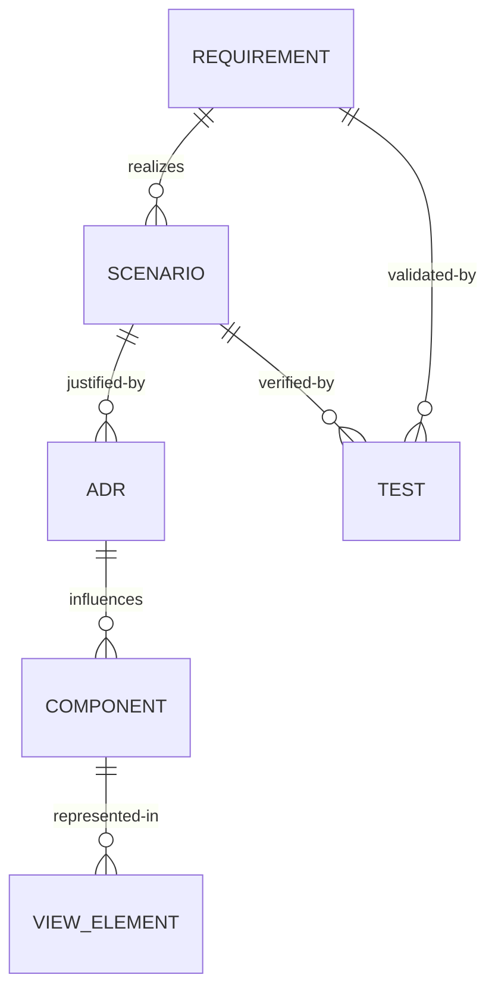

# Architecture Traceability Matrix

End-to-end linkage across requirements, architecture, decisions, scenarios, components, views, and tests. Enables automated CI validation.

## Data Model (Conceptual)


## Traceability Table
| Requirement ID | Scenario ID(s) | ADR ID(s) | Component ID(s) | View(s) | Test ID(s) | Gaps |
|----------------|---------------|----------|-----------------|---------|-----------|------|
| REQ-NF-P-001 | QA-SC-001 | ADR-002 | ARC-C-007 | logical, process, deployment | TEST-PERF-001 |  |
| REQ-NF-S-001 | QA-SC-003 | ADR-004 | ARC-C-003, ARC-C-010 | security, logical | TEST-SEC-LOGIN-001 |  |
| REQ-F-010 | QA-SC-002 | ADR-003 | ARC-C-002 | deployment, data | TEST-AVAIL-FAILOVER-001 |  |
| **REQ-EXT-001** | **QA-SC-EXT-001** | **ADR-002, ADR-009** | **ARC-C-EXT-001** | **container, logical** | **TEST-EXT-SCHEMA-001** | **Phase 05 Implementation** |
| **REQ-EXT-002** | **QA-SC-EXT-002** | **ADR-009, ADR-011** | **ARC-C-EXT-001, ARC-C-EXT-002** | **container, deployment** | **TEST-EXT-HTTP-001** | **Phase 05 Implementation** |
| **REQ-EXT-003** | **QA-SC-EXT-003** | **ADR-002, ADR-009** | **ARC-C-EXT-003** | **container, logical** | **TEST-EXT-XSD-001** | **Phase 05 Implementation** |
| **REQ-EXT-004** | **QA-SC-EXT-004** | **ADR-010** | **ARC-C-EXT-004** | **container, process** | **TEST-EXT-INTEROP-001** | **Phase 05 Implementation** |
| **REQ-EXT-005** | **QA-SC-EXT-005** | **ADR-011** | **ARC-C-EXT-005** | **deployment, build** | **TEST-EXT-BUILD-001** | **Phase 05 Implementation** |

## Orphan Detection Checklist
- [ ] Any Requirement without Scenario
- [ ] Any Scenario without ADR
- [ ] Any ADR without Component
- [ ] Any Component not present in at least one View
- [ ] Any Scenario without Test (or planned test ID)
- [ ] Any Requirement without Test coverage

## Automation Guidance
Represent this matrix as JSON (example) for CI script validation:
```json
[
  {
    "requirement": "REQ-NF-P-001",
    "scenarios": ["QA-SC-001"],
    "adrs": ["ADR-002"],
    "components": ["ARC-C-007"],
    "views": ["logical", "process", "deployment"],
    "tests": ["TEST-PERF-001"],
    "gaps": []
  }
]
```
CI Rule Examples:
- Fail if any field array empty (except gaps) for Critical requirements
- Warn if multiple requirements map to >5 ADRs (possible over-complexity)
- Warn if one ADR influences >10 components (possible centralization risk)

## Metrics
| Metric | Target | Calculation |
|--------|--------|-------------|
| Requirement Coverage | 100% | (# requirements with ≥1 scenario)/(total) |
| Scenario Test Coverage | 100% | (# scenarios with ≥1 test)/(total scenarios) |
| ADR Linkage Completeness | 100% | (# ADRs linked to ≥1 requirement)/(total ADRs) |
| Component View Coverage | 100% | (# components in ≥1 view)/(total components) |
| Average Components per ADR | < 8 | sum(components linked)/#ADRs |

## External Authority Compliance Requirements

**Added for Standards Compliance (2025-01-09)**:

### Requirements
- **REQ-EXT-001**: System MUST validate XML against external Project.xsd and MetaData.xsd schemas
- **REQ-EXT-002**: System MUST download and cache external schemas without internalizing them  
- **REQ-EXT-003**: System MUST perform XSD validation using external authoritative schemas only
- **REQ-EXT-004**: System MUST validate interoperability with external DAW applications
- **REQ-EXT-005**: Build system MUST support external authority dependencies (libxml2, libcurl)

### Components
- **ARC-C-EXT-001**: ExternalSchemaManager - Downloads and manages external XSD schemas
- **ARC-C-EXT-002**: HTTPClient - Network operations for external resource access
- **ARC-C-EXT-003**: ExternalValidationEngine - XSD validation against external schemas
- **ARC-C-EXT-004**: InteroperabilityValidator - Cross-DAW compatibility validation
- **ARC-C-EXT-005**: BuildDependencyManager - External authority dependency integration

### Quality Scenarios
- **QA-SC-EXT-001**: When XML is validated, system validates against external Project.xsd within 5 seconds
- **QA-SC-EXT-002**: When schemas are updated, system downloads new versions within 30 seconds
- **QA-SC-EXT-003**: When XSD validation fails, system provides detailed compliance error report
- **QA-SC-EXT-004**: When DAWProject is exported, system validates Bitwig/PreSonus compatibility
- **QA-SC-EXT-005**: When building with external dependencies, system configures libxml2/libcurl automatically

## Review Notes
Record anomalies, justification for intentional gaps, and planned remediation.

**External Authority Compliance (2025-01-09)**:
- All external authority requirements have gaps marked as "Phase 05 Implementation"
- Implementation requires dual XML parsing strategy (pugixml + libxml2)
- Network dependencies require careful error handling and fallback strategies
- Cross-platform build complexity increases with external dependencies
